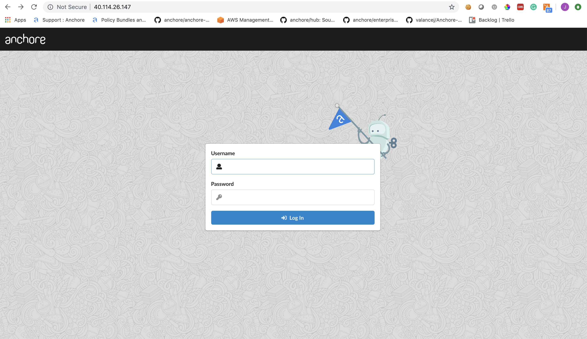

This document will walkthrough the installation of Anchore Enterprise in an Azure Kubernetes Service (AKS) cluster and expose it on the public internet. 
## Prerequisites

- A running AKS cluster with worker nodes launched. See [AKS Documentation](https://docs.microsoft.com/en-us/azure/aks/) for more information on this setup. 
- [Helm](https://helm.sh/) client on local host.
- [Anchore CLI](https://docs.anchore.com/current/docs/installation/anchore_cli/) installed on local host. 

Once you have an AKS cluster up and running with worker nodes launched, you can verity via the followiing command. 

```
$ kubectl get nodes
NAME                       STATUS   ROLES   AGE     VERSION
aks-nodepool1-28659018-0   Ready    agent   4m13s   v1.13.10
aks-nodepool1-28659018-1   Ready    agent   4m15s   v1.13.10
aks-nodepool1-28659018-2   Ready    agent   4m6s    v1.13.10
```

## Anchore Helm Chart

Anchore maintains a [Helm chart](https://github.com/helm/charts/tree/master/stable/anchore-engine) to simplify the software installation process. An Enterprise installation of the chart will include the following:

- Anchore Enterprise software
- PostgreSQL (9.6.2)
- Redis (4)

To make the necessary configurations to the Helm chart, create a custom `anchore_values.yaml` file and reference it during installation. There are many options for configuration with Anchore, this document is intended to cover the minimum required changes to successfully install Anchore Enterprise in AKS. 

**Note:** For this installation, an NGINX ingress controller will be used. You can read more about Kubernetes Ingress in AKS [here](https://docs.microsoft.com/en-us/azure/aks/ingress-basic).


### Configurations

Make the following changes below to your `anchore_values.yaml`

#### Ingress

```
ingress:
  enabled: true
  labels: {}
  # Use the following paths for GCE/ALB ingress controller
  # apiPath: /v1/*
  # uiPath: /*
  apiPath: /v1/
  uiPath: /
    # Uncomment the following lines to bind on specific hostnames
    # apiHosts:
    #   - anchore-api.example.com
    # uiHosts:
    #   - anchore-ui.example.com
  annotations:
    kubernetes.io/ingress.class: nginx
```

**Note:** Configuring ingress is optional. It is used throughout this guide to expose the Anchore deployment on the public internet.

#### Anchore Engine API Service

```
# Pod configuration for the anchore engine api service.
anchoreApi:
  replicaCount: 1

  # Set extra environment variables. These will be set on all api containers.
  extraEnv: []
    # - name: foo
    #   value: bar

  # kubernetes service configuration for anchore external API
  service:
    type: NodePort
    port: 8228
    annotations: {}
```

**Note:** Changed the service type to NodePort

#### Anchore Enterprise Global

```
anchoreEnterpriseGlobal:
  enabled: true
```

#### Anchore Enterprise UI

```
anchoreEnterpriseUi:
  # kubernetes service configuration for anchore UI
  service:
    type: NodePort
    port: 80
    annotations: {}
    sessionAffinity: ClientIP
```

**Note:** Changed service type to NodePort.

### Install NGINX Ingress Controller

Using Helm, install an NGINX ingress controller in your AKS cluster.

```
helm install stable/nginx-ingress --set controller.nodeSelector."beta\.kubernetes\.io/os"=linux --set defaultBackend.nodeSelector."beta\.kubernetes\.io/os"=linux
```

### Install Anchore Enterprise

#### Create secrets

Enterprise services require an Anchore Enterprise license, as well as credentials with permission to access the private DockerHub repository containing the enterprise software.

Create a kubernetes secret containing your license file:

`kubectl create secret generic anchore-enterprise-license --from-file=license.yaml=<PATH/TO/LICENSE.YAML>`

Create a kubernetes secret containing DockerHub credentials with access to the private Anchore Enterprise software:

`kubectl create secret docker-registry anchore-enterprise-pullcreds --docker-server=docker.io --docker-username=<DOCKERHUB_USER> --docker-password=<DOCKERHUB_PASSWORD> --docker-email=<EMAIL_ADDRESS>`

Install Anchore Enterprise:

`helm install --name anchore-enterprise stable/anchore-engine -f anchore_values.yaml`

It will take the system several minutes to bootstrap. You can checks on the status of the pods by running `kubectl get pods`:

```
$ kubectl get pods
NAME                                                              READY   STATUS    RESTARTS   AGE
anchore-enterprise-anchore-engine-analyzer-64b4b67b9-5wtk6        1/1     Running   0          5m22s
anchore-enterprise-anchore-engine-api-df99bdbfb-gzn8t             4/4     Running   0          5m22s
anchore-enterprise-anchore-engine-catalog-864668c549-lqr46        1/1     Running   0          5m22s
anchore-enterprise-anchore-engine-enterprise-feeds-6f8d8ffk5qlb   1/1     Running   0          5m22s
anchore-enterprise-anchore-engine-enterprise-ui-5bb8b78446mnpm5   1/1     Running   0          5m22s
anchore-enterprise-anchore-engine-policy-5469f97dc-jdtls          1/1     Running   0          5m22s
anchore-enterprise-anchore-engine-simplequeue-7554bc6bd-gkzdh     1/1     Running   0          5m22s
anchore-enterprise-anchore-feeds-db-8c8686fd7-s79jm               1/1     Running   0          5m22s
anchore-enterprise-anchore-ui-redis-master-0                      1/1     Running   0          5m22s
anchore-enterprise-postgresql-57f65cb6d5-r6cz6                    1/1     Running   0          5m22s
mangy-serval-nginx-ingress-controller-788dd98c8b-jv2wg            1/1     Running   0          21m
mangy-serval-nginx-ingress-default-backend-8686cd585b-4m2bt       1/1     Running   0          21m
```

We can see that NGINX ingress controller has been installed as well from the previous step. You can view the services by running the following command:

```
$ kubectl get services | grep ingress
mangy-serval-nginx-ingress-controller                LoadBalancer   10.0.30.174    40.114.26.147   80:31176/TCP,443:30895/TCP                     22m
mangy-serval-nginx-ingress-default-backend           ClusterIP      10.0.243.221   <none>          80/TCP                                         22m
```

**Note:** The above output shows us that IP address of the NGINX ingress controller is **40.114.26.147**. Going to this address in the browser will take us to the Anchore login page.



#### Anchore System

Check the status of the system with the Anchore CLI to verify all of the Anchore services are up:

**Note:** Read more on [Configuring the Anchore CLI](https://docs.anchore.com/current/docs/installation/anchore_cli/cli_config/)

```
$ anchore-cli --url http://40.114.26.147/v1/ --u admin --p foobar system status
Service analyzer (anchore-enterprise-anchore-engine-analyzer-64b4b67b9-5wtk6, http://anchore-enterprise-anchore-engine-analyzer:8084): up
Service simplequeue (anchore-enterprise-anchore-engine-simplequeue-7554bc6bd-gkzdh, http://anchore-enterprise-anchore-engine-simplequeue:8083): up
Service policy_engine (anchore-enterprise-anchore-engine-policy-5469f97dc-jdtls, http://anchore-enterprise-anchore-engine-policy:8087): up
Service apiext (anchore-enterprise-anchore-engine-api-df99bdbfb-gzn8t, http://anchore-enterprise-anchore-engine-api:8228): up
Service rbac_authorizer (anchore-enterprise-anchore-engine-api-df99bdbfb-gzn8t, http://localhost:8089): up
Service reports (anchore-enterprise-anchore-engine-api-df99bdbfb-gzn8t, http://anchore-enterprise-anchore-engine-enterprise-reports:8558): up
Service rbac_manager (anchore-enterprise-anchore-engine-api-df99bdbfb-gzn8t, http://anchore-enterprise-anchore-engine-api:8229): up
Service catalog (anchore-enterprise-anchore-engine-catalog-864668c549-lqr46, http://anchore-enterprise-anchore-engine-catalog:8082): up

Engine DB Version: 0.0.13
Engine Code Version: 0.7.1
```

#### Anchore Feeds

It can take some time to fetch all of the vulnerability feeds from the upstream data sources. Check on the status of feeds with the Anchore CLI:

```
$ anchore-cli --url http://40.114.26.147/v1/ --u admin --p foobar system feeds list
```

**Note:** It is not uncommon for the above command to return a: `[]` as the initial feed sync occurs. 

Once the vulnerability feed sync is complete, Anchore can begin to return vulnerability results on analyzed images. Please continue to the [Usage]() section of our documentation for more information.
