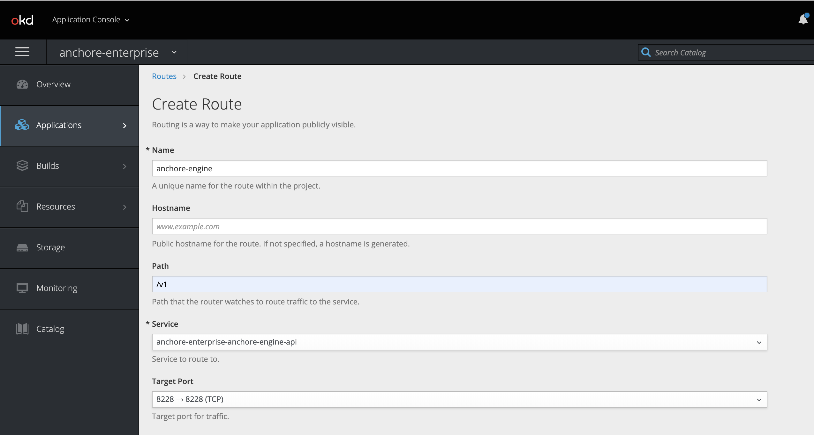
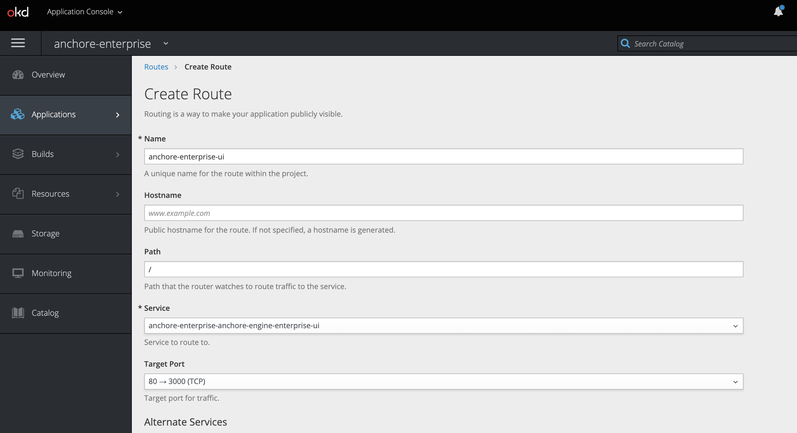
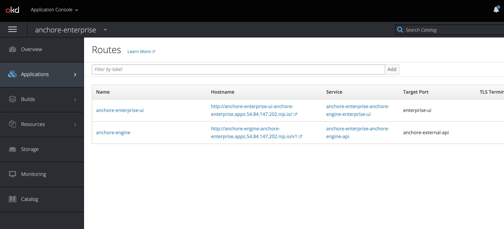
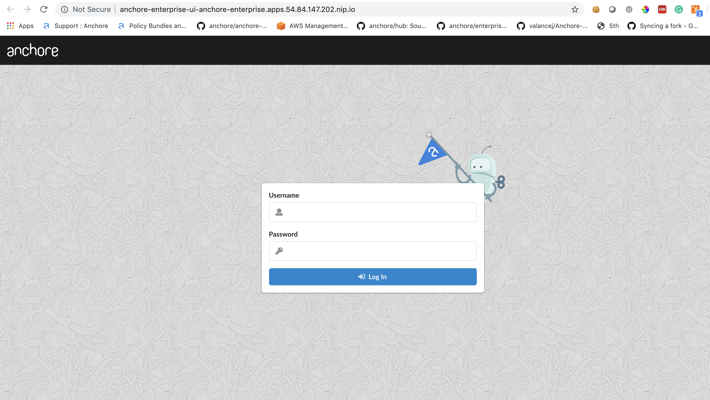

This document will walkthrough the installation of Anchore Enterprise on an OpenShift Kubernetes Distribution (OKD) 3.11 cluster and expose it on the public internet.

**Note:** While this document walks through deploying on OKD 3.11, it has been successfully deployed and tested on OpenShift 4.2.4 and 4.2.7.

## Prerequisites

- A running OpenShift Kubernetes Distribution (OKD) 3.11 cluster. Read more about the installation requirements [here](https://docs.okd.io/3.11/install/running_install.html).
  - **Note:** If deploying to a running OpenShift 4.2.4+ cluster, read more about the installation requirements [here](https://docs.openshift.com/container-platform/4.2/welcome/index.html).
- [Helm](https://helm.sh/) client and server installed and configured with your cluster.
- [Anchore CLI](https://docs.anchore.com/current/docs/installation/anchore_cli/) installed on local host.

## Anchore Helm Chart

Anchore maintains a [Helm chart](https://github.com/helm/charts/tree/master/stable/anchore-engine) to simplify the software installation process. An Enterprise installation of the chart will include the following:

- Anchore Enterprise Software
- PostgreSQL (9.6.2)
- Redis 4

To make the necessary configurations to the Helm chart, create a custom `anchore_values.yaml` file and reference it during installation. There are many options for configuration with Anchore, this document is intended to cover the minimum required changes to successfully install Anchore Enterprise on OKD 3.11.

### OpenShift Configurations

#### Create a new project

Create a new project called anchore-enterprise:

`oc new-project anchore-enterprise`

#### Grant edit access to the tiller server

Grant edit access to the tiller server so it can modify the new project

```
oc policy add-role-to-user edit \
"system:serviceaccount:${TILLER_NAMESPACE}:tiller"
role "edit" added: "system:serviceaccount:tiller:tiller"
```

### Create secrets

Two secrets are required for an Anchore Enterprise installation.

Create a secret for the license file:
`oc create secret generic anchore-enterprise-license --from-file=license.yaml=license.yaml`

Create a secret for pulling the images:
`oc create secret docker-registry anchore-enterprise-pullcreds --docker-server=docker.io --docker-username=<username> --docker-password=<password> --docker-email=<email>`

Verify these secrets are in the correct namespace: anchore-enterprise

`oc describe secret <secret-name>`

#### Link ImagePullSecret

Link the above Docker registry secret to the default service account:

`oc secrets link default anchore-enterprise-pullcreds --for=pull --namespace=anchore-enterprise`

Verify this by running the following:

`oc describe sa`

**Note:** Validate your OpenShift SCC. Based on the security constraints of your environment, you may need to change SCC. `oc adm policy add-scc-to-user anyuid -z default`

### Anchore Configurations

Create a custom `anchore_values.yaml` file for your Anchore Enterprise deployment:

```
postgresql:
  image: registry.access.redhat.com/rhscl/postgresql-96-rhel7
  imageTag: latest
  extraEnv:
  - name: POSTGRESQL_USER
    value: anchoreengine
  - name: POSTGRESQL_PASSWORD
    value: anchore-postgres,123
  - name: POSTGRESQL_DATABASE
    value: anchore
  - name: PGUSER
    value: postgres
  - name: LD_LIBRARY_PATH
    value: /opt/rh/rh-postgresql96/root/usr/lib64
  - name: PATH
    value: /opt/rh/rh-postgresql96/root/usr/bin:/opt/app-root/src/bin:/opt/app-root/bin:/usr/local/sbin:/usr/local/bin:/usr/sbin:/usr/bin:/sbin:/bin
  persistence:
    size: 20Gi

anchoreGlobal:
  openShiftDeployment: True

anchoreEnterpriseGlobal:
  enabled: True

anchore-feeds-db:
  image: registry.access.redhat.com/rhscl/postgresql-96-rhel7
  imageTag: latest
  extraEnv:
  - name: POSTGRESQL_USER
    value: anchoreengine
  - name: POSTGRESQL_PASSWORD
    value: anchore-postgres,123
  - name: POSTGRESQL_DATABASE
    value: anchore-feeds
  - name: PGUSER
    value: postgres
  - name: LD_LIBRARY_PATH
    value: /opt/rh/rh-postgresql96/root/usr/lib64
  - name: PATH
    value: /opt/rh/rh-postgresql96/root/usr/bin:/opt/app-root/src/bin:/opt/app-root/bin:/usr/local/sbin:/usr/local/bin:/usr/sbin:/usr/bin:/sbin:/bin
  persistence:
    size: 30Gi

anchore-ui-redis:
  password: anchore-postgres,123
```

#### Install software

Run the following command to install the software:

`helm install --name anchore-enterprise -f values.yaml stable/anchore-engine`

It will take the system several minutes to bootstrap. You can checks on the status of the pods by running `oc get pods`:

```
$ oc get pods
NAME                                                              READY     STATUS    RESTARTS   AGE
anchore-enterprise-anchore-engine-analyzer-cfddf6b56-9pwm9        1/1       Running   0          15h
anchore-enterprise-anchore-engine-api-5b5bffc79f-vmwvl            4/4       Running   0          15h
anchore-enterprise-anchore-engine-catalog-b88d4dff4-jhm4t         1/1       Running   0          15h
anchore-enterprise-anchore-engine-enterprise-feeds-5956cdbrkd62   1/1       Running   0          15h
anchore-enterprise-anchore-engine-enterprise-ui-7d8fdb69d858bxc   1/1       Running   0          15h
anchore-enterprise-anchore-engine-policy-84b6dbdfd-fvnll          1/1       Running   0          15h
anchore-enterprise-anchore-engine-simplequeue-dc58c69c9-5rmj9     1/1       Running   0          15h
anchore-enterprise-anchore-feeds-db-fc665b76-9q6rb                1/1       Running   0          15h
anchore-enterprise-anchore-ui-redis-master-0                      1/1       Running   0          15h
anchore-enterprise-postgresql-795fd9c476-5z526                    1/1       Running   0          15h
```

### Create route objects

Create two route object in the OpenShift console to expose the UI and API services on the public internet:

**Note:** Route configuration is optional. It is used throughout this guide to expose the Anchore deployment on the public internet.

#### API Route


#### UI Route


#### Routes


Verify by navigating to the anchore-enterprise-ui route hostname:



#### Anchore System

Verify API route hostname with the Anchore CLI:

**Note:** Read more on [Configuring the Anchore CLI](https://docs.anchore.com/current/docs/installation/anchore_cli/cli_config/)

```
$ anchore-cli --url http://anchore-engine-anchore-enterprise.apps.54.84.147.202.nip.io/v1 --u admin --p foobar system status
Service rbac_manager (anchore-enterprise-anchore-engine-api-5b5bffc79f-vmwvl, http://anchore-enterprise-anchore-engine-api:8229): up
Service analyzer (anchore-enterprise-anchore-engine-analyzer-cfddf6b56-9pwm9, http://anchore-enterprise-anchore-engine-analyzer:8084): up
Service apiext (anchore-enterprise-anchore-engine-api-5b5bffc79f-vmwvl, http://anchore-enterprise-anchore-engine-api:8228): up
Service reports (anchore-enterprise-anchore-engine-api-5b5bffc79f-vmwvl, http://anchore-enterprise-anchore-engine-enterprise-reports:8558): up
Service simplequeue (anchore-enterprise-anchore-engine-simplequeue-dc58c69c9-5rmj9, http://anchore-enterprise-anchore-engine-simplequeue:8083): up
Service policy_engine (anchore-enterprise-anchore-engine-policy-84b6dbdfd-fvnll, http://anchore-enterprise-anchore-engine-policy:8087): up
Service rbac_authorizer (anchore-enterprise-anchore-engine-api-5b5bffc79f-vmwvl, http://localhost:8089): up
Service catalog (anchore-enterprise-anchore-engine-catalog-b88d4dff4-jhm4t, http://anchore-enterprise-anchore-engine-catalog:8082): up

Engine DB Version: 0.0.11
Engine Code Version: 0.5.0
```

#### Anchore Feeds

It can take some time to fetch all of the vulnerability feeds from the upstream data sources. Check on the status of feeds with the Anchore CLI:

```
$ anchore-cli --url http://anchore-engine-anchore-enterprise.apps.54.84.147.202.nip.io/v1 --u admin --p foobar system feeds list
Feed                   Group                  LastSync                          RecordCount
nvdv2                  nvdv2:cves             None                              0
vulnerabilities        alpine:3.10            2019-10-03T15:05:23.878969        1485
vulnerabilities        alpine:3.3             2019-10-03T15:05:23.898953        457
vulnerabilities        alpine:3.4             2019-10-03T15:05:23.923604        678
vulnerabilities        alpine:3.5             2019-10-03T15:05:23.944190        875
vulnerabilities        alpine:3.6             2019-10-03T15:05:23.967389        1049
vulnerabilities        alpine:3.7             2019-10-03T15:05:23.985487        1253
vulnerabilities        alpine:3.8             2019-10-03T15:05:24.003828        1332
vulnerabilities        alpine:3.9             2019-10-03T15:05:24.021340        1428
vulnerabilities        amzn:2                 2019-10-03T15:05:24.038047        219
vulnerabilities        centos:5               2019-10-03T15:05:24.056800        1145
vulnerabilities        centos:6               2019-10-03T15:05:24.075533        1117
vulnerabilities        centos:7               2019-10-03T15:05:24.092966        870
vulnerabilities        centos:8               2019-10-03T15:05:24.110261        76
vulnerabilities        debian:10              2019-10-03T15:05:24.140262        17809
vulnerabilities        debian:11              2019-10-03T15:05:24.169900        17720
vulnerabilities        debian:8               2019-10-03T14:55:20.216348        22339
vulnerabilities        debian:9               2019-10-03T14:55:20.247996        20475
vulnerabilities        debian:unstable        2019-10-03T14:55:20.278812        19647
vulnerabilities        ol:5                   2019-10-03T14:56:03.555345        1238
vulnerabilities        ol:6                   2019-10-03T15:00:44.582514        1455
vulnerabilities        ol:7                   2019-10-03T15:05:19.911031        1036
vulnerabilities        ol:8                   2019-10-03T15:05:23.850474        68
```

**Note:** It is not uncommon for the above command to return a: [] as the initial feed sync occurs.

Once the vulnerability feed sync is complete, Anchore can begin to return vulnerability results on analyzed images. Please continue to the [Usage]() section of our documentation for more information.
