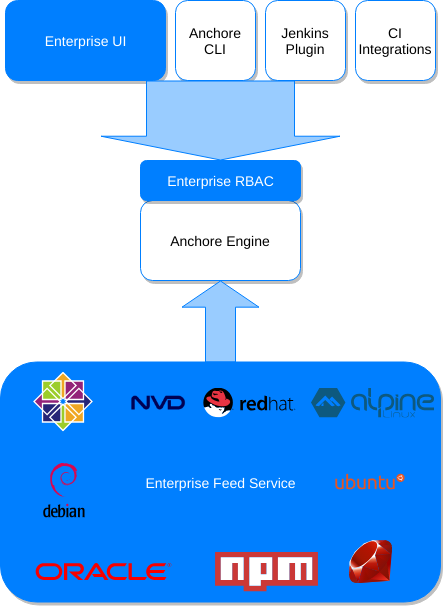

### What is Anchore Enterprise?

**_Anchore Enterprise_** is the commercial product built on the open-source Anchore Engine, with added components and features to enhance the use of Anchore at an organizational level, visualize data, and provide additional installation options to meet enterprise needs. It also adds services and support to both the open-source and proprietary components.

### What is Anchore Engine?

**_Anchore Engine_** is an open-source Docker container static analysis and policy-based compliance tool that automates the inspection, analysis, and evaluation of images against user-defined checks to allow high confidence in container deployments by ensuring workload content meets the required criteria. Anchore Engine ultimately provides a policy evaluation result for each image: pass/fail against policies defined by the user. Additionally, the way that policies are defined and evaluated allows the policy evaluation itself to double as an audit mechanism that allows point-in-time evaluations of specific image properties and content attributes.

### Anchore Enterprise vs. Anchore Engine

**_Anchore Enterprise_** provides features and capabilities in addition to those of the open-source **_Anchore Engine_**. 

- On-premises UI for visualization, policy editing, report generation, and user management
- RBAC support for the APIs
- Proprietary vulnerability data feeds to significantly enhance vulnerability detection in application packages and libraries (e.g. python, ruby gems, nodejs packages, java jars, .NET NuGet packages...)
- Fully On-Premises Vulnerability Feed Service providing vulnerability and package metadata
    - Full data provenance from vendor sources (RedHat, Debian, etc) into the analysis engine
    - Enables Air-Gapped deployments
- Commercial Support (8 / 5 or 24 / 7)

## Software Components

- On-Premises Anchore Engine (Open Source)
- On-Premises Anchore Enterprise UI
- On-Premises Feed Service
- RBAC Management API
- RBAC Authorization Plugin (used with the Anchore Engine)

### Next Steps

Now, let's get familiar with the architecture of Anchore Enterprise.

To begin, go to [Anchore Enterprise Architecture]()
