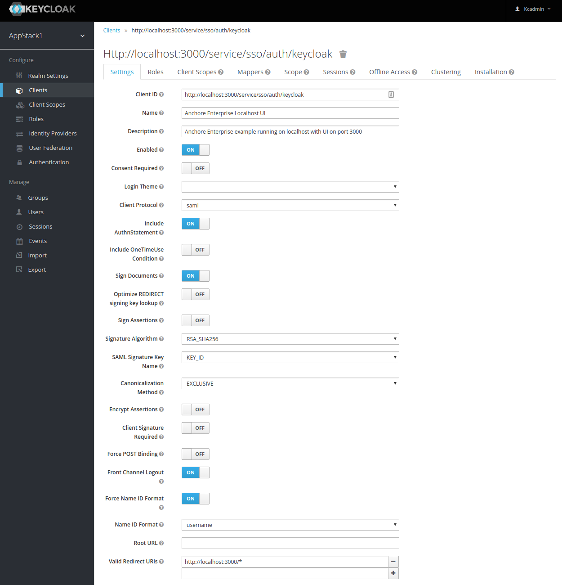
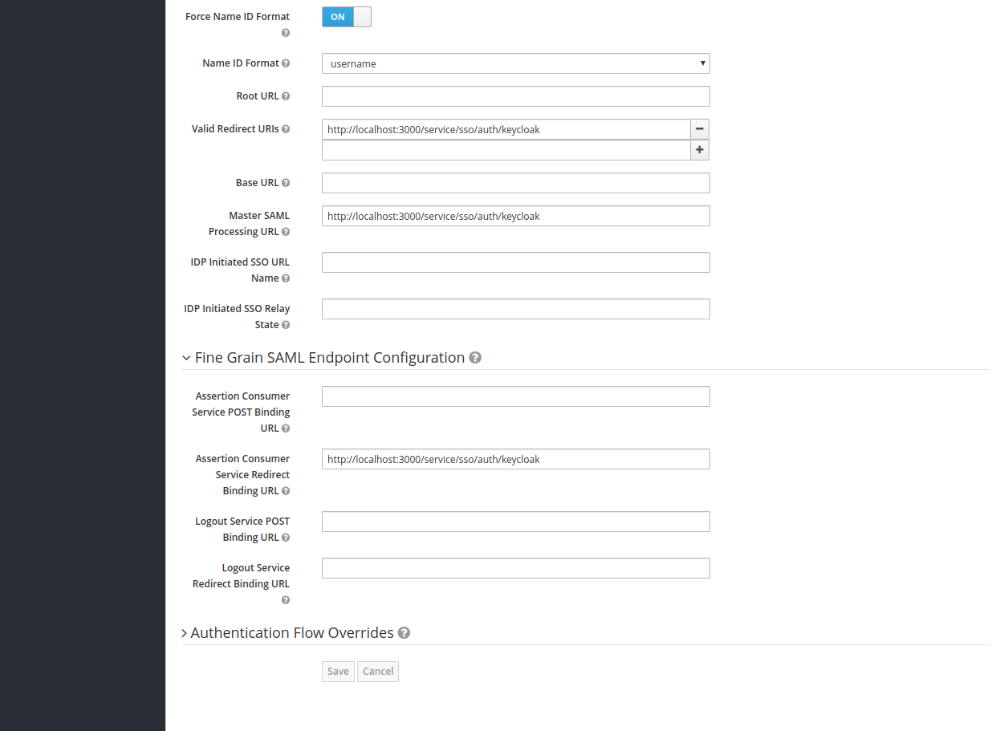
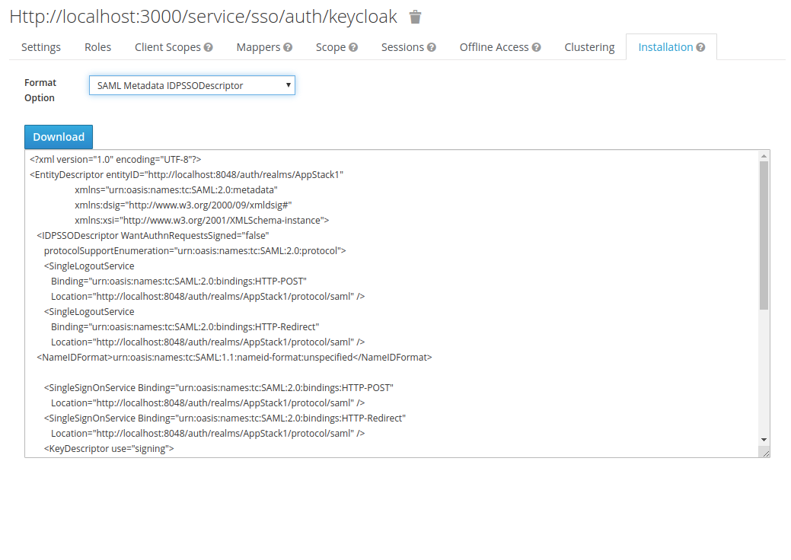
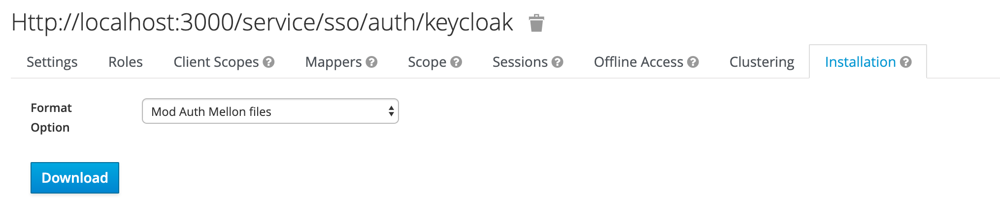
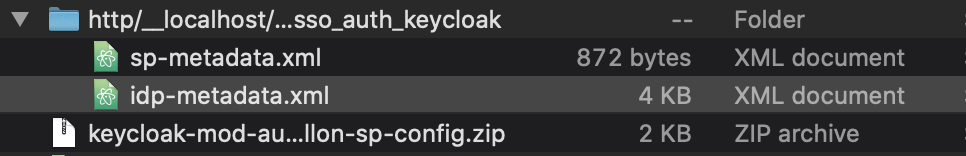
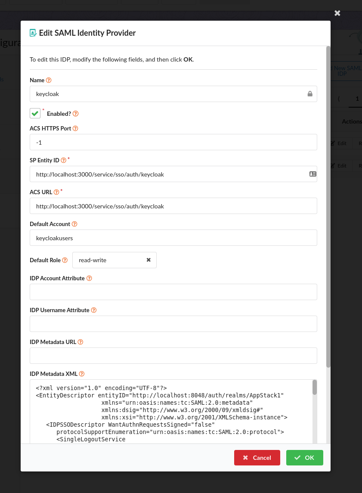
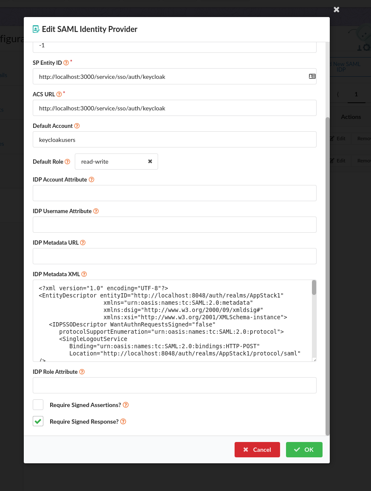

## Configuring SAML SSO for Anchore with KeyCloak

The JBoss KeyCloak system is a widely used and open-source identity management system that supports integration with applications via SAML and OpenID Connect. It also can operate as an identity broker
between other providers such as LDAP or other SAML providers and applications that support SAML or OpenID Connect.

The following is an example of how to configure a new client entry in KeyCloak and configure Anchore to use it to permit UI login by KeyCloak users that are granted access via KeyCloak configuration.

## Configuring KeyCloak

Anchore supports multiple IDP configurations, each given a name. For this example we'll choose the name "keycloak" for our configuration.
This important as that name is used in several URL paths to ensure that the correct configuration is used for validating responses,
so make sure you pick a name that is meaningful to your users (they will see it in the login screen) and also that is url friendly.

Some config choices and assumptions specifically for this example:
1. Let's assume that you are running Anchore Enterprise locally. Anchore Enterprise UI is available at: `https://localhost:3000`. Replace with the appropriate url as needed.
1. We're going to choose `keycloak` as the name of this saml/sso configuration within Anchore. This will identify the specific configuration and is used in urls.
1. Based on that, the Single-SignOn URL for this deployment will be: `https://localhost:3000/service/sso/auth/keycloak`
1. Our SP Entity ID will use the same url: `http://localhost:3000/service/sso/auth/keycloak`

## Add a Client entry in KeyCloak

1. See [SAML Clients](https://www.keycloak.org/docs/latest/server_admin/index.html#saml-clients) in KeyCloak documentation

1. For this example, set the following values in "Add Client" screen (these are specific to the settings in this example described above):
    1. Client ID - `http://localhost:3000/service/sso/auth/keycloak` - This will be the SP Entity ID used in the Anchore configuration later
    1. Client Protocol: "saml"
    1. Client SAML Endpoint: "http://localhost:3000/service/sso/auth/keycloak"

1. In the next screen, Client Settings

      

    1. Name - "Anchore Enterprise". This is only used to display a friendly name to Keycloak users in the KeyCloak UI. Can use any name you like.
    1. Enabled - Select on
    1. Include Authn Statement - Select on
    1. Sign Documents - Select on
    1. Client Sign Authn Requests - Select Off
    1. Sign Assertions - Select off
    1. Encrypt Assertions - Select off
    1. Client Signature Required - Select off
    1. Force Post Binding - Select off. Anchore requires the HTTP Redirect Binding to work, so this setting must be off to enable that.
    1. Force Name ID Format - Select on
    1. Name ID Format - Select username or email (transient uses a generated UUID per login and persistent use the Keycloak user's UUID)
    1. Root URL - Leave empty
    1. Valid Redirect URIs - Add `http://localhost:3000/service/sso/auth/keycloak`
    1. Base URL - Leave empty
    1. Master SAML Processing URL - `http://localhost:3000/service/sso/auth/keycloak`    
    1. Fine Grain SAML Endpoint Configuration
        1. Assertion Consumer Service Redirect Binding URL - `http://localhost:3000/service/sso/auth/keycloak`    

    1. Save the configuration

    

1. Download the metadata xml to import into Anchore

    1. Select 'Installation' tab.
    1. Select Format

      * **Keycloak <= 5.0.0**

      1. Select Format Option - SAML Metadata IDPSSODescriptor
        

      * **Keycloak 6.0.0+**

      1. Select Format Option - Mod Auth Mellon files
        
      2. Unzip the downloaded .zip and locate `idp-metadata.xml`
        
    1. Download or copy the XML to save in the Anchore configuration

## Configure Anchore Enterprise to use the KeyCloak

1. You'll need the following information from keycloak to enter in the Anchore UI:
  1. The name to use fo the configuration, in this example `keycloak`
  1. Metadata XML downloaded or copied from the previous section

1. In the Anchore UI, create an SSO IDP Configuration:
  1. Login as admin
  1. Select "Configuration" Tab on the top
  1. Select "SSO" on the left-side menu
  1. Click "Let's Add One" in the configuration listing

  

  1. Enter the values:
    1. Name: "keycloak" - This is the name of the configuration and will be referenced in login and sso URLs, so we use the value chosen at the beginning of this example
    1. Enabled: True - This controls whether or not users will be able to login with this configuration. We'll enable it for the example but can disable later if no longer needed.
    1. ACS HTTPS Port: -1 or 443 - This is the port to use for HTTPS to the ACS (Assertion Consumer Service, in this case the UI). It is only needed if you need to use a non-standard https port
    1. SP Entity ID: `http://localhost:3000/service/sso/auth/keycloak` (NOTE: this must match the Client ID you used for the Client in the KeyCloak setup
    1. ACS URL: `http://localhost:3000/service/sso/auth/keycloak`
    1. Default Account: `keycloakusers` for this example, but can be any account name (existing or not) that you'd like the users to be members of. See [Mappings]() for more information on how this
    1. Default Role: `read-write` for this example so that the users have full access to the account to analyze images, setup policies, etc.
    1. IDP Metadata XML: Paste the downloaded or copied XML from KeyCloak in step 4.3 above
    1. Require Signed Assertions - Select off
    1. Require Signed Response - Select on
    1. Save the configuration

You should now be see a 'keycloak' option in the login screen for the Anchore Enterprise UI. This will redirect users to login to the KeyCloak instance for their username/password and will create a new user in Anchore in the `keycloakusers` account with read-write role.   
