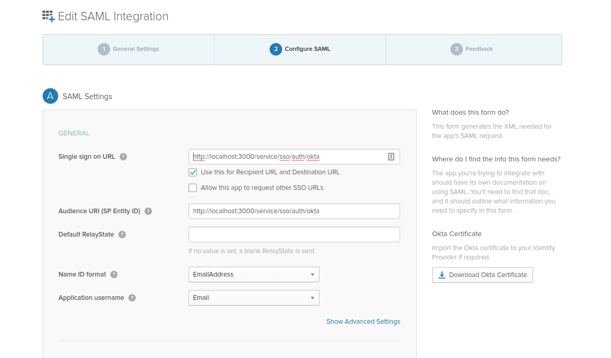
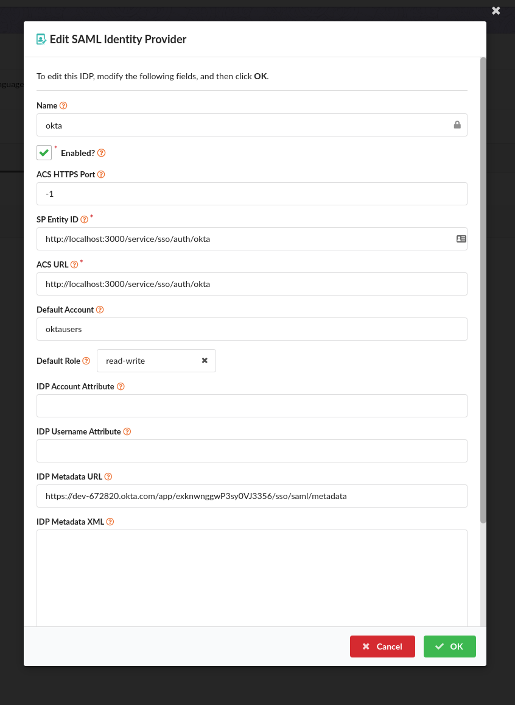
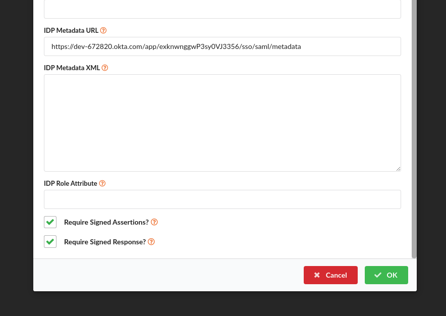

## Configuring SAML SSO for Anchore with Okta

Some config choices and assumptions specifically for this example:

1. Anchore UI endpoint: `https://localhost:3000`. Replace with the appropriate url as needed.
1. IDP Config Name: `okta`. This will identify the specific configuration and is used in urls, and can be any url-safe string you'd like.
1. The Single Sign-on URL (also called the Assertion Consumer Service/ACS URL) for this deployment will be: `https://localhost:3000/service/sso/auth/okta`. 
This is constructed with the UI endpoint and path _/service/sso/auth/{IDP Config Name}_
1. Our SP Entity ID will use the same url: `http://localhost:3000/service/sso/auth/okta`. This could be different but for simplicity we use the same value.
 
### Configure Okta: Add an Application 

See [Okta SAML confg](https://developer.okta.com/docs/guides/saml-application-setup/overview/) to see how to create a new 
application authorization server. The following steps are used during specific steps of that walk-thru

1. In step #6 
    1. `Single sign on URL`, this is the URL Okta will direct users to. This must be a URL in the Anchore Enterprise UI 
    based on the name you chose for the configuration. In our example: `http://localhost:3000/service/sso/auth/okta`
    1. Set the `Use this for Receipient URL and Destination URL` checkbox as well.
    a1. Set the `Audience URI(SP Entity ID)` to a URI that will identify the anchore installation. This can be the same as 
    the single-sign-on URL for simplicity. We'll need to enter this value later in the Anchore config as well.
    1. Leave `Default RelayState` empty
    1. `Name ID format` can be left "Unspecified" or set to an email or username format.
    1. Choose the application username that makes sense for your install. Anchore can support a regular username or email address for the usernames.
1. In step #7, these attribute statements are not required but can be set. This is, however, where you can set additional 
attributes that you want Anchore to use to initialize the user's Anchore account or permission set. Later in the IdP configuration 
you can specify attributes that Anchore will look for to extract the account names and roles for initializing a user that doesn't yet exist in Anchore.
1. In step #9, be sure to copy the metadata URL link so you have that. Anchore will need that value. 
    1. Right-click here and copy the link address:  The 
    URL should be something like: `https://<youraccount>.okta.com/app/<appid>/sso/saml/metadata`    
1. Finish the setup and save the Application entry.    
1. Important: To allow Okta users to login to Anchore you need to assign the Okta user to this new Application entry. See 
[Assign and unassign apps to users](https://help.okta.com/en/prod/Content/Topics/Directory/eu-assign-apps.htm) for information on this process.     

### Configure Anchore Enterprise to use the Okta Identity Provider
    
You'll need the following information from okta to enter in the Anchore UI:
* The name chosen for the configuration: `okta` in this case
* Metadata XML URL (from "configuring okta" step 3.1 above)
* The Single Sign-on/ACS URL described in Step 3
  
In the Anchore UI, create an SSO Idp Configuration:

1. Login as admin
1. Select "Configuration" Tab on the top
1. Select "SSO" on the left-side menu
1. Click "Let's Add One" in the configuration listing
1. Enter the values:
    * Name: `okta` - This is the name of the configuration and will be referenced in login and sso URLs, so we use the value 
    chosen at the beginning of this example
    * Enabled: True - This controls whether or not users will be able to login with this configuration. We'll enable it for 
    the example but can disable later if no longer needed.
    * ACS HTTPS Port: -1 or 443 - This is the port to use for HTTPS to the ACS (Assertion Consumer Service, in this case the UI). It is only needed if you need to use a non-standard https port 
    * ACS URL: `http://localhost:3000/service/sso/auth/okta`
    * Default Account - The account to add all okta users to when they login, for this example we use `oktausers`
    * Default Role - The role to grant okta users when they login in initially. For this example, we use `read-write`, the standard user type that has most abilities except user management.
    * IDP Metadata URL - The url from "Configure Okta" step 3.1
    * Require Signed Assertions - Select On
    * Require Signed Response - Select On

1. Save the configuration, configuration is complete and you should see a login with 'okta' option on the login screen. 
Users can now login to your Anchore deployment using this Okta endpoint.

And scrolling down...     

See: [Mapping Users and Roles in SSO]() for more information on using the account 
and role defaults, IDP attribute values and understanding how identities are mapped into Anchore's RBAC system.
