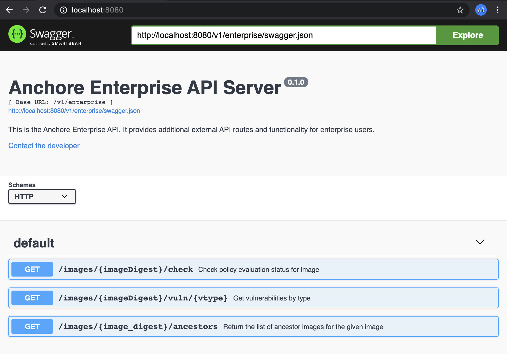

Anchore Enterprise API is an extension to the Anchore API. It is documented using the OpenAPI Specification (Swagger) and can be accessed in a variety of ways.    

### Local Swagger JSON

The JSON definition for the Enterprise API specification for your specific instance can be downloaded from a running Anchore Enterprise service at the following URI:

http://{servername:port}/v1/enterprise/swagger.json

e.g.

http://localhost:8228/enterprise/swagger.json

### Local Swagger UI

Follow these [instructions]() for setting up Swagger UI. Point your browser at http://localhost:8080/ and after the Swagger UI loads, input http://localhost:8080/v1/enterprise/swagger.json into the Explore box

   

