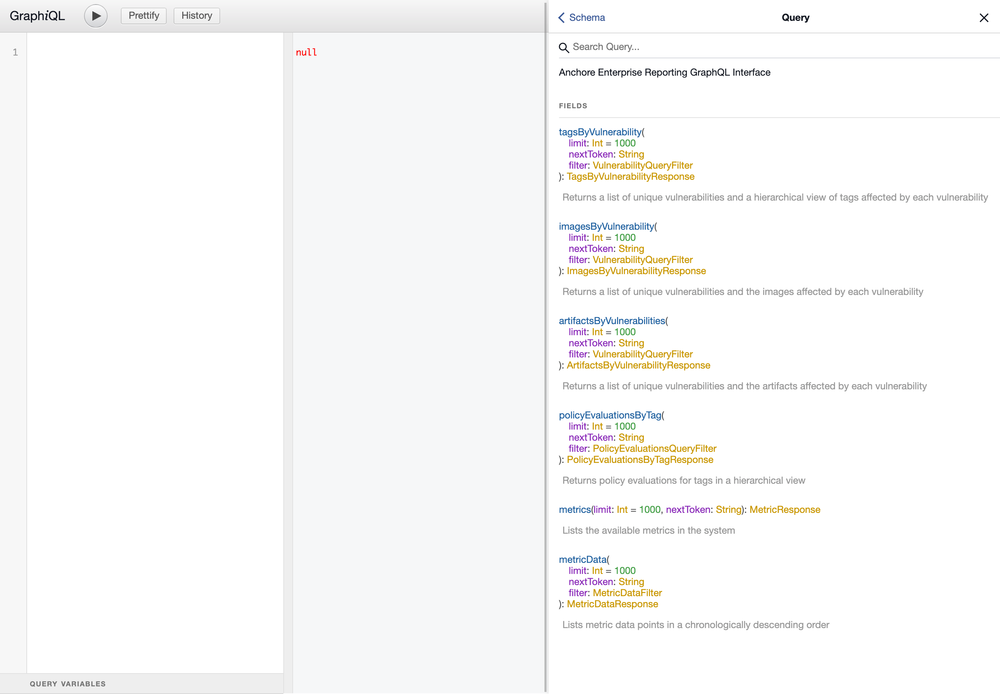
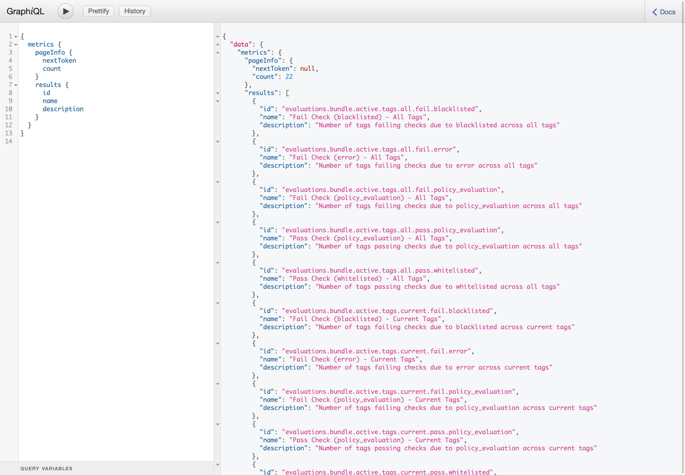

Anchore Enterprise Reports provides a [GraphQL](https://graphql.org/) API for direct interaction with the service. GraphQL is a query language for APIs and a runtime for fulfilling those queries. 
 
### Get started

There are different ways of interacting with the Anchore Enterprise Reports GraphQL API. Following sections highlight two different options for exploring the Anchore Enterprise Reports GraphQL schema with a few examples  

#### Interactive GUI
One of the ways of exploring and testing a GraphQL schema is by using [GraphiQL](https://electronjs.org/apps/graphiql). Anchore Enterprise Reports Service has GraphiQL built-in to the service and enabled by default. 

To access it in a running Anchore Enterprise deployment, open http://\<servername:port\>/v1/reports/graphql in a browser and input your Anchore Engine credentials. Click the Docs tab to view the self-describing schema 



In addition to being able to see the API docs, GraphiQL is handy for exploring and constructing queries supported by the backing API. Here is an example of a query for available metrics in the system. Happy querying!



#### Command line using curl 

You can also use curl to send HTTP requests to Anchore Enterprise Reports API. To view the schema

```bash
$ curl -u <username:password> -X POST "http://<servername:port>/v1/reports/graphql?query=%7B__schema%7BqueryType%7Bname%20description%20fields%7Bname%20description%20args%7Bname%20description%20type%7Bname%20kind%7D%7D%7D%7D%7D%7D%0A"
``` 

### Pagination

Depending on the size of data set (i.e. number of tags, images etc in the system) results of a query could be very large. Reports service implements pagination for all queries to better handle the volume of the results and respond to the clients within a reasonable amount of time.

Structure of every query contains a metadata object called `pageInfo`
```
{
  imagesByVulnerability {
    pageInfo {
      nextToken
      count
    }
    results {
      ...
    }
  }
}
``` 

Including this object in the query is recommended even though its optional. It instructs the Reports service to return metadata about the response. Response structure mirrors the query structure and should contain the requested metadata  
```
{
  "data": {
    "imagesByVulnerability": {
      "pageInfo": {
        "nextToken": "Q1ZFLTIwMTYtMTAyNjY=",
        "count": 1000
      },
      "results": [
        ...
      ]
    }
  }
}      
```

A non-null `nextToken` indicates that results are paginated. To get the next page of results, fire the same query along with `nextToken` as a query parameter
```
{
  imagesByVulnerability(nextToken: "Q1ZFLTIwMTYtMTAyNjY=") {
    pageInfo {
      nextToken
      count
    }
    results {
      ...
    }
  }
}
```       

### Some useful queries 

#### Vulnerability centric queries

- List vulnerabilities of a specific severity. And include all the images, currently or historically mapped to a tag, affected by each vulnerability 
    
    Use the query's `filter` argument for specifying the conditionality          
    ```
    {
      imagesByVulnerability(filter: {vulnerability: {severity: Critical}, tag: {currentOnly: false}}) {
        pageInfo {
          nextToken
        }
        results {
          vulnerabilityId
          links
          imagesCount
          images {
            digest
          }
        }
      }
    }
    ```
    To get more details such as tag mappings for the image, add the relevant attributes from the schema to the body of the query.       
    

- List vulnerabilities detected in the last x hours. And include all the images, currently or historically mapped to a tag, affected by each vulnerability    
    
    Use `vulnerability` filter's `after` and `before` attributes for specifying a time window. They accept a UTC timestamp  
    
    ```
    {
      imagesByVulnerability(filter: {vulnerability: {after: "2019-08-01T00:00:00"}, tag: {currentOnly: false}}) {
        pageInfo {
          nextToken
        }
        results {
          vulnerabilityId
          images {
            digest
          }
        }
      }
    }
    ```

- Given a vulnerability ID, list all the artifacts affected by that vulnerability. And include all the images, currently or historically mapped to a tag, containing the said artifact  
    ```
    {
      artifactsByVulnerability(filter: {vulnerability: {id: "CVE-2019-15213"}, tag: {currentOnly: false}}) {
        pageInfo {
          nextToken
        }
        results {
          vulnerabilityId
          links
          artifactsCount
          artifacts {
            artifactName
            artifactVersion
            artifactType
            severity
            images {
              digest
            }
          }
        }
      }
    }
    ```
  
#### Policy evaluation centric queries

- Given a repository, get the policy evaluation results for all the tags currently mapped to an image (historical tag-image mappings excluded) using the active policy bundle in its current state 
    ```
    {
      policyEvaluationsByTag(filter: {registry: {name: "docker.io"}, repository: {name: "library/node"}}) {
        pageInfo {
          nextToken
        }
        results {
          repositories {
            tagsCount
            tags {
              tagName
              imageDigest
              evaluations {
                result
                reason
              }
            }
          }
        }
      }
    }
    ```

- Given a tag, get the policy evaluation history. Include policy evaluations encompassing updates to the tag and the active policy bundle
    
    Reports service defaults to the "current" state for computing results. To compute results across historic state, a few `filter` knobs have to be turned
    * `tag` -> `currentOnly` set to `false` instructs the service to include all, current and historic, image tag mappings 
    * `policyEvaluation` -> `latestOnly` set to `false` instructs the service to include all, current and historic, policy evaluations
    * `policyBundle` -> `active` set to `false` instructs service to include all, current and historic, active policy bundles         

    ```
    {
      policyEvaluationsByTag(filter: {registry: {name: "docker.io"}, repository: {name: "library/node"}, tag: {name: "latest", currentOnly: false}, policyEvaluation: {latestOnly: false}, policyBundle: {active: false}}) {
        pageInfo {
          nextToken
        }
        results {
          repositories {
            tags {
              imageDigest
              detectedAt
              current
              evaluations {
                result
                reason
                lastEvaluatedAt
                policyBundle {
                  bundleId
                  bundleDigest
                }
                latest
              }
            }
          }
        }
      }
    }
    ``` 

#### Metric centric queries
  
- List all the available metrics 
    ```
    {
      metrics {
        pageInfo {
          nextToken
        }
        results {
          id
          name
          description
          metricType
        }
      }
    }
    ```

- Given a metric ID, list values for that metric within a period of time. Useful for plotting changes over a timescale
    ```
    {
      metricData(filter: {metricId: "vulnerabilities.tags.all.critical", start: "2019-08-01T00:00:00", end: "2019-09-01T00:00:00"}) {
        pageInfo {
          nextToken
        }
        results {
          collectedAt
          value
        }
      }
    }
    ```
