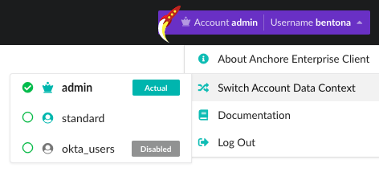
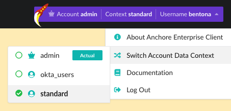
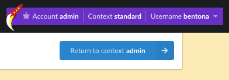
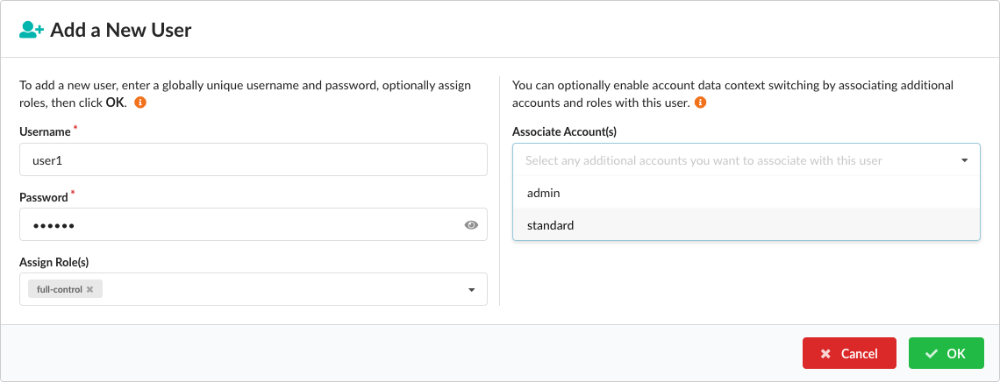
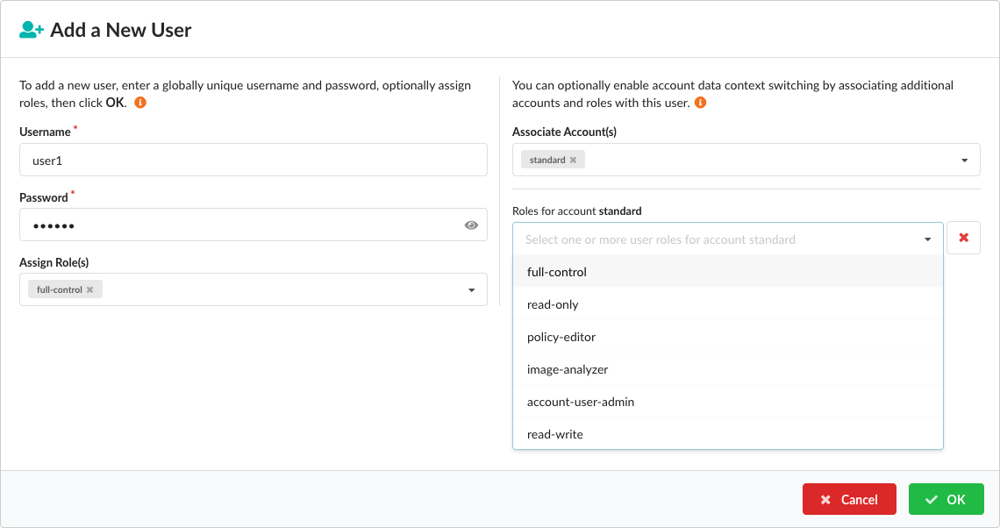
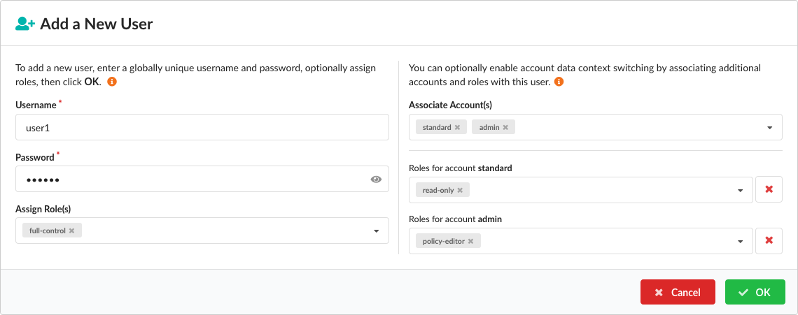

### Overview

Administrators and specially-entitled standard users are offered the ability to _context switch_ between the image analysis data contexts of different accounts. This capability allows you to view the analysis data held inside a different account while still retaining your own user profile configuration.

When you switch data context, the data-oriented aspects of the application will change but the qualities specific to your original account—herein referred to as your _actual_ account—remain the same. Administrators keep their original permission set and have full control within the switched account. The account availability and associated permission set for standard users is decided by the role configuration of their switching entitlement, and these roles can be additionally set to differ per account.

This feature allows users to gain insights into multiple datasets, can be used by administrators for troubleshooting purposes or to make _ad-hoc_ modifications to the data-oriented aspects of any account, and provides standard users with an additional level and vector of access control.

This following sections in this document describes how to switch and reset data contexts—both as an administrator and as a standard user—and how administrators can assign this capability to standard users.

### Administrative Users

Context switching as as an administrator is available without prior configuration, and only requires that an account other than your own be available. When you click the account button in the top-right of the screen you are presented with a menu that contains an entry called **Switch Account Data Context**, which will be enabled when one or more accounts other than your own are present.

Clicking this item displays a submenu that describes all currently available accounts—both active and disabled—into which you can switch context:

Your home account is represented by the label **Actual**. If an account is disabled, this is indicated by the label **Disabled** (note that only administrators can context switch into disabled accounts). The account category—administrator or standard user—is indicated by the user-type icon.

Your current data context is represented by an entry with an emphasized title and checkmark prefix. When you click an entry for a different account, the application view will switch to use the data provided by this new context. The account button and dropdown items are similarly updated to reflect this change:

You will also notice a change to the background color of the main view, which serves as a reminder that your current data context is now different than the one provided by your actual account. In addition, a button is now present on the navigation bar that allows you to immediately revert to your actual data context when clicked (you can of course also use the menu to do this):

In the above example, the analysis information now presented is exactly what a user of the **standard** account would see in _their_ actual account. As an administrator, you are now free to browse and interact with this data, add tags or repositories for analysis, create policies etc., and there are no permission restrictions on any of these operations.

**Note:** only the _analysis data context_ has switched, and this new state does not extend to _application data items_ such a private registry configurations.

### Standard Users

Non-administrative users can also switch context if this capability has been conferred upon them by an administrator within an RBAC-enabled environment.

When you add a new standard user (or modify an existing one) you can optionally associate them with one or more additional accounts, providing those accounts are not currently disabled. The **Add a New User** dialog, which is accessed from within the account editor in the **Configuration > Accounts** view, is shown below:

**Note:** If an account is currently active and available for addition, but is subsequently _disabled_, the standard user will not be able to switch into that account.

For each associated account you must also provide one or more RBAC _roles_ that determine how the standard user can interact with that account after they have switched context:

For example, a user may have full-control within their actual account, but could be restricted to read-only operations after switching context. You can provide multiple different roles for different accounts, but you must provide _at least one_ role per account association:

Account associations can also be removed by clicking the **X** adjacent to each role list, or by removing the labels directly from the **Associate Account(s)** dropdown control.

Once you are satisfied with the user configuration, click **OK** to create (or update) these associations. The standard user will now be able to switch account data context using the same procedure as the one described for administrators, presented earlier in this document.