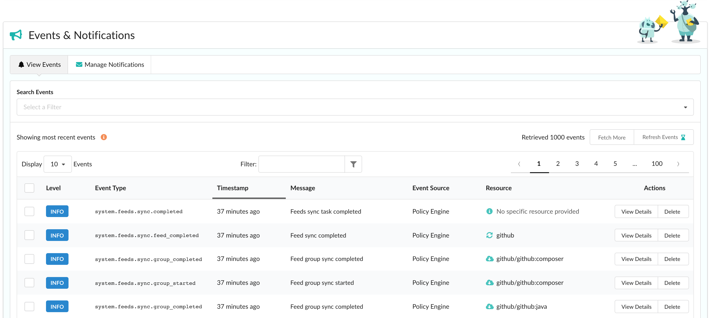
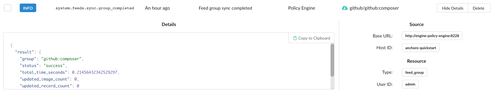
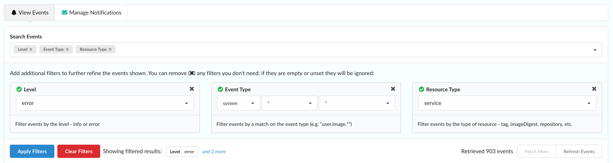
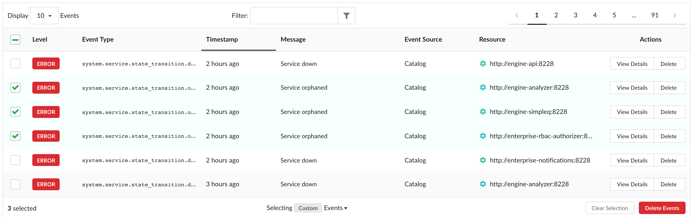

### Overview

The Events tab is your gateway to current and historical activity happening in your system. View various events such as policy evaluation and vulnerability updates, system errors, feed syncs, and more.

The following sections in this document describe how to view event details, how to filter for specific events you're interested in, and how to manage events with bulk deletion.

### Viewing Events

In order to view events, navigate to the **Events & Notifications > View Events** tab. By default, the most recent activity (up to 1000 events) is shown and is automatically updated for you every 5 minutes. Note that if you have applied any filters through the search bar, your results will need to be refreshed manually.

Top-level details such as the event's level (whether it's an INFO or ERROR event), type, message, and affected resource is shown. Dig in to a specific event by clicking **View Details** under its **Actions** column to expand the row.

Additional information such as the origininating service and host ID are available in the expanded row. Any details given by the service are also provided in JSON format to view or copy to clipboard.

### Filtering Events

Often, you might want to search for a specific event type or events that happened after a certain time. In this case, use the **Search Events** bar near the top of the page to select a filter to search on. These include:

Level
: Filter events by level - INFO or ERROR

Event Type
: Filter events by a match on the event type (e.g. "user.image.\*")

Since
: Return events that occurred after the timestamp

Before
: Return events that occurred before the timestamp

Source Servicename
: Filter events by the originating service

Source Host ID
: Filter events by the originating host ID

Resource Type
: Filter events by the type of resource - tag, imageDigest, repository, etc.

Resource ID
: Filter events by the id of the resource

Once you have selected and populated the filter fields you're interested in, click **Apply Filters** to search and show those filtered results.

An alternative way to filter your results is through the in-table filter input. Note that this only applies against any data already fetched. To increase what you're filtering on, click **Fetch More** near the top-right of the table for up to an additional 1000 items.

To remove any filters and reset to the default view, click **Clear Filters**.

### Deleting Events

To assist with event management, event deletion has been added in the Enterprise 2.3 release.

Deleting individual events can be done simply through clicking **Delete** under the **Actions** column and selecting **Yes** to confirm. Note that after deletion, events are not recoverable.

Multi-select is available for deleting multiple events at a time. Upon selecting an event using the checkbox in the far-left column, a toolbar-like component will slide in at the bottom of the table. The number of events selected is shown along with the selection type, **Clear Selection**, and **Delete Events** options.

Checking the box in the header will select all events within that page.

By default, it is viewed as a **Custom** selection. Choosing to select **All Retrieved** events auto-selects everything already fetched and present in the table (i.e. if a filter is applied, events not matching the filter are not selected but will be upon removal of the filter). In this state, deselecting an item will trigger a custom selection again.

Selecting **All** events will again auto-select all events already fetched and present in the table but while applying a filter may modify what's viewable, this option is solely for clearing the entire backlog of events - including those not shown. In this state, deselecting an item will also trigger a custom selection.

Once you have selected the events you wish to remove, click **Delete Events** to open a modal and review up to 50 items. Any events you don't wish to delete anymore can be deselected as well. To continue with removal, click **Yes** to confirm and start the process.

Note that events are account-wide and that any events removed will be mirrored across all users in the account.
