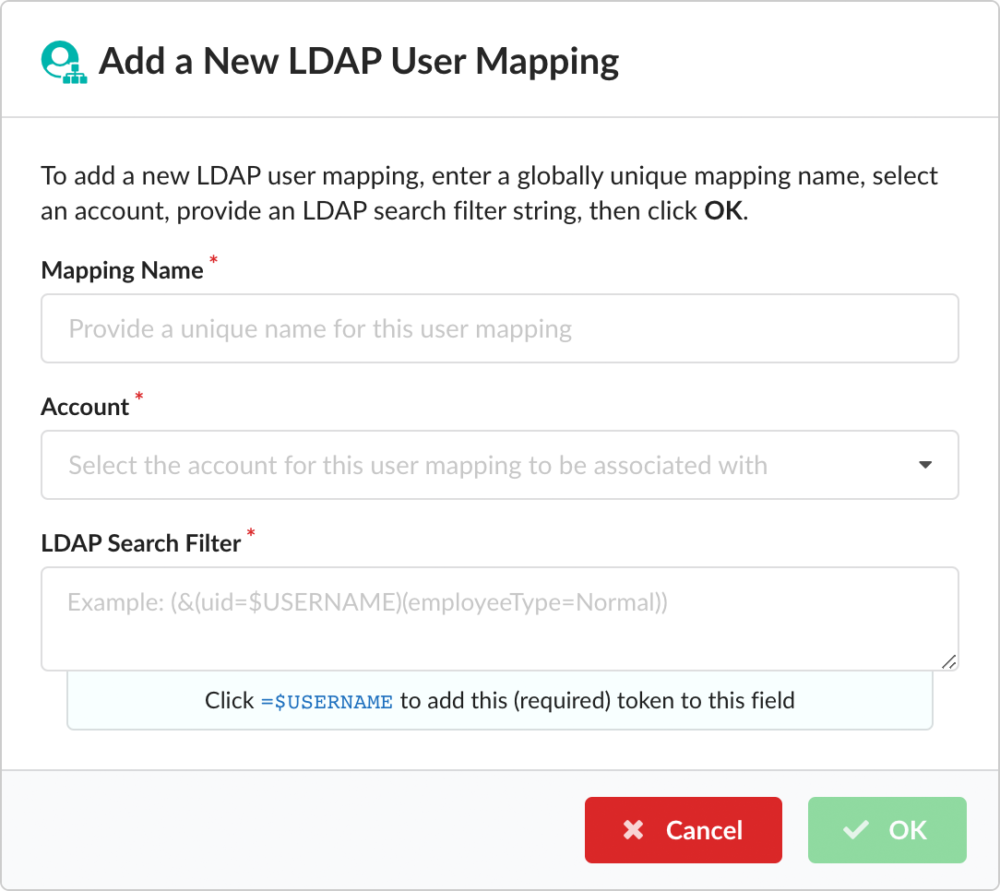
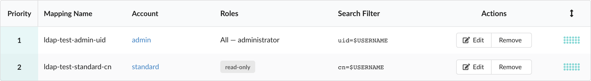
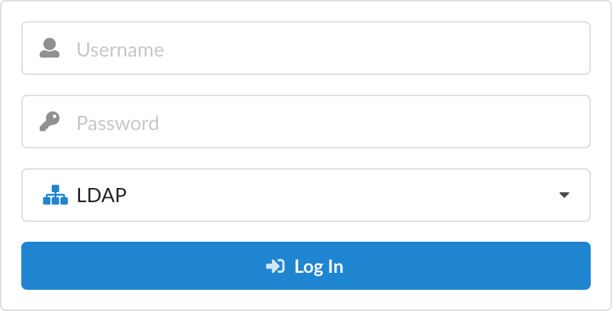

<style>
	table td:first-child {
		min-width: 12rem;
	}
	img.img_medium {
		max-width: 30rem !important;
	}
	img.img_mini {
		max-width: 2rem !important;
	}
</style>

### Overview

The Lightweight Directory Access Protocol (LDAP) is a standardized and widely-used client-server protocol for accessing directory information, and can be enabled in Anchore Enterprise Client to authenticate users against an existing directory server.

In order to configure Anchore Enterprise Client for use with LDAP, the requisite information for connecting and authenticating with an LDAP directory server must first be provided by an administrator. For the purposes of determining what users can see and do once they are logged in, the administrator must also create one or more account association entries, called _user mappings_.

When an LDAP user authenticates, the Anchore Engine account associated with their session is determined by the first user mapping containing a search filter that matches the information in their LDAP record. LDAP authentication will fail if&nbsp;_no_ matches are found, if the associated account is disabled, or if the user's login credentials are incorrect.

The following sections in this document describe how to configure the Anchore Enterprise Client for use with an LDAP directory server, how to add user mappings, and how to log in to the application as an LDAP user.

### Server Connection Properties

Administrators can provide the information used to connect Anchore Enterprise Client to an LDAP server from the **LDAP** sidetab in the **Configuration** view. Please note that this sidetab is not visible to non-administrative users.

The connection property fields shown in this view are described below:


|    Property      |    Description     |
|------------------|--------------------|
| Server URI       | The `ldap://` or `ldaps://` URI of the LDAP directory server to query. |
| Manager DN       | The distinguished name (DN) of an LDAP directory manager that the Anchore Enterprise Client can use to perform further queries about LDAP users during login. The directory manager is typically a privileged server administrator who, once authenticated, can access the LDAP record of any user intended to access the application. |
| Manager Password | The password associated with the Manager DN.  |
| Base DN          | The relative distinguished name in the LDAP directory tree hierarchy under which queries about users should be performed.       |

After you have entered the required connection properties, click the **Save** button to store them. Once stored, you can click the **Test** button to verify that the application can authenticate with the LDAP server using the details you've provided.

**Note:** Clicking **Save** when no values are provided in any of the fields will disable LDAP in the application and prevent **LDAP** from being displayed as an authentication option on the login screen.

### User Mappings
LDAP user mappings contain search filters that unite the results of searches made against the data attributes of LDAP records with account information stored in Anchore Engine.

When an LDAP user submits their credentials on the login page, the first match encountered will provide Anchore Enterprise Client with an associated Anchore Engine account that is used to define the scope of what the user can see and do once they are fully authenticated.

If a match is detected, the submitted password is then validated against the one stored inside the matched LDAP record. If the password is correct and the associated Anchore Engine account is not suspended, the user will be successfully logged in. If no match is found or the password is incorrect, authentication will fail.

#### Adding a User Mapping

User mappings can be created by administrators from inside an account within the **Accounts** sidetab in the **Configuration** view, or from the **LDAP** sidetab in the area below the server connection properties form.

To add a new user mapping containing an LDAP search filter, click the **Add New LDAP User Mapping** button—or if no user mappings are currently defined, click the **Let's add one!** button in the empty table.

You will be presented a dialog, similar to the one shown below, where you can provide an LDAP search filter:



#### LDAP Search Filters
The LDAP search filter in each mapping provides the criteria for associating that mapping with an Anchore Engine account. For example:

```
uid=$USERNAME
```

In the above example, the user mapping requires that the [`uid`](https://tools.ietf.org/html/rfc4519#section-2.39) (user ID) attribute in an LDAP record matches the data represented by the `$USERNAME` token.

The `=$USERNAME` string is a required entry, and the actual value of the token resolves to whatever value the user enters in the **Username** field when they log in to Anchore Enterprise Client.

In Microsoft<sup>®</sup> Active Directory<sup>®</sup> (AD) implementations that support the LDAP protocol, the [`sAMAccountName`](https://docs.microsoft.com/en-us/windows/desktop/ADSchema/a-samaccountname) attribute is the broad equivalent of `uid`:

```
sAMAccountName=$USERNAME
```

**Note:** The submitted value of `$USERNAME` should always correspond to an attribute with a _unique_ value within the LDAP user record, or one that is unique in combination with other criteria. In Active Directory, the uniqueness of `sAMAccountName` is enforced, whereas  this may not be true for `uid` (which is an optional attribute in AD).

Additional filter criteria beyond the user identity can be provided to assert granular control over user access. The following examples describe filters with narrower scope:

```
(&(cn=$USERNAME)(|(ou:dn:=Administrative)(ou:dn:=Management)))
```
```
(&(ou=devops)(uniqueMember=uid=$USERNAME,dc=example,dc=org))
```

A detailed summary of the syntax and formula of LDAP search filters is beyond the scope of this document, however [RFC 1558](https://tools.ietf.org/html/rfc1558) provides a comprehensive description of how these entries are structured.

#### Mapping Order

By default, mappings are evaluated in priority order, with new entries being stored at the lowest priority. It can be challenging to infer the exact order of all mappings when they are spread across multiple accounts, so the table listing all current mappings the **LDAP** sidetab shows the priority of every item and includes the account with which they are associated. Example:



From here you can move row entries to a higher or lower order of precedence by clicking down on a hotspot () and then dragging the row up or down the list.

The priority order of user mappings determines the order in which search filters are evaluated when a user logs in. The first mapping to successfully locate an LDAP user record that matches the `$USERNAME` and any other criteria in its search filter will be used to determine the Anchore Engine account association for that user.

Once a user is located, subsequent mapping entries will be ignored, regardless of (possibly narrower) specificity, as only priority order matters here.

#### Test Mapping Behavior

You can evaluate the behavior of your user mappings by entering `$USERNAME` data (for example, the `uid` of a user) in the **Check $USERNAME Against LDAP Mappings** search field.

If an LDAP record is located that matches the search filter criteria of a mapping, you'll be informed of which mapping provided the match, the associated Anchore Engine user, and the distinguished name of the user whose LDAP record was returned.

### Login With LDAP Credentials

If a set of valid LDAP server connection properties have been stored by an administrator, the **LDAP** authentication option is activated in the application login view, in addition to the **Default** option of authenticating against the user records stored in Anchore Engine:



The value entered in the **Username** field will be used by the application to populate the `$USERNAME` token when evaluating each user mapping. The value entered in the **Password** field will be used to authenticate the matched user with the LDAP directory server.

Once these operations have completed, and providing the account associated with the mapping is not disabled, the user will be logged in.


