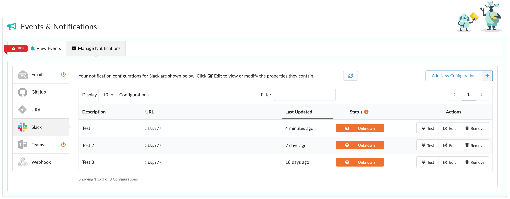
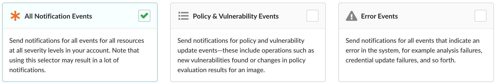
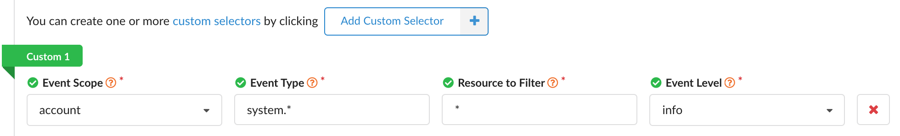
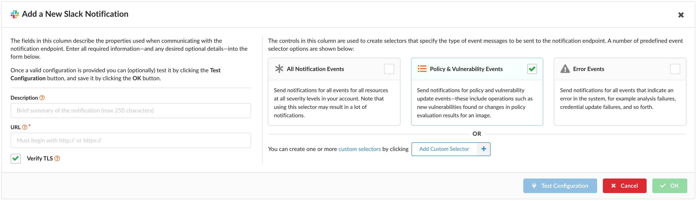
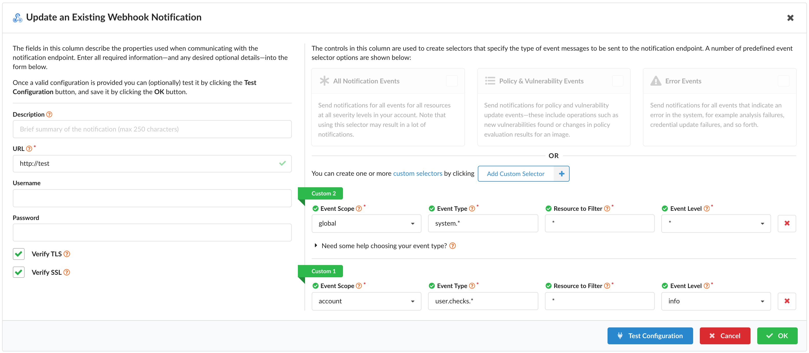
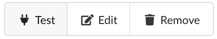
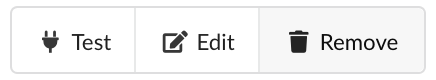
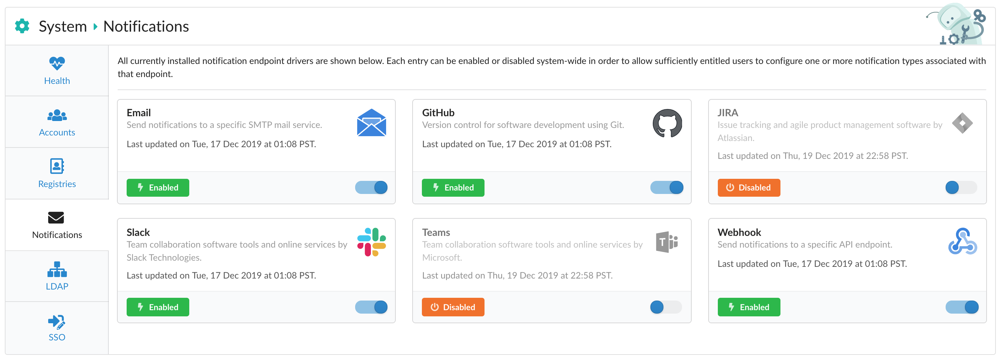

### Overview

Added in Anchore Enterprise v2.2

Alert external endpoints (Email, GitHub, Slack, and more) about Anchore events such as policy evaluation results, vulnerability updates, and system errors with our new Notifications service. Configure notification endpoints and manage which specific events you need through Anchore Enterprise UI.

For more information on the Notifications Service in general, its concepts, and details on its configuration, please refer to the [Notifications Service]().

The following sections in this document describe the current endpoints available for configuration, the options provided for selecting events, the various actions you can do with a configuration (add, edit, test, and remove), and how to disable an endpoint as an admin.

### Notifications

#### Supported Endpoints

Email
: Send notifications to a specific SMTP mail service.

GitHub
: Version control for software development using Git.

JIRA
: Issue tracking and agile product management software by Atlassian.

Slack
: Team collaboration software tools and online services by Slack Technologies.

Teams
: Team collaboration software tools and online services by Microsoft.

Webhook
: Send notifications to a specific API endpoint.

#### Event Selector Options

When adding or editing a configuration, selecting which events to be notified on can be as easy as choosing one of the above three options: *All Notification Events*, *Policy & Vulnerability Events*, or *Error Events*.

Advanced users can select *Add Custom Selector* for more granularity:

In the example shown, we configure to be notified on all system info events affecting any resource associated with the user's account. For an in-depth explanation on the provided properties and their possible values, view our [Selector]() documentation.

#### Adding a Configuration

If you haven't already defined a configuration for an endpoint, simply click *Let's Add One!* as shown above. Once you have, add additional configurations with *Add New Configuration* as shown below.

Upon doing so, a modal will appear with various properties shown on the left side. Note that based on the type of endpoint, these properties may differ.

To view the various requirements, check the documentation for [Email](), [GitHub](), [JIRA](), [Slack](), and [Teams]().

For more information on adding a custom selector, please view our [Selector]() documentation.

Prior to saving your new configuration, feel free to test with the *Test Configuration* button. Then save with *OK*.

**Note:** If *OK* is not enabled, be sure all required fields have been filled out.

#### Editing a Configuration

The process to edit a configuration entry is started by clicking *Edit* which is found within the *Actions* column as shown above.

The various fields available for editing are the same shown when adding the configuration. For additional info on a specific field, hover over the provided question icon circled with an orange ring next to the field name.

At any time, you can select *Cancel* to disregard any changes you've made.

For testing any new changes prior to saving them, click *Test Configuration*.

To save your changes, click *OK*. If *OK* is not enabled, be sure all required fields have been filled out.

#### Testing a Configuration

When viewing your configurations, testing is easy - just look under the *Actions* column and click *Test* for that entry.

Otherwise, when adding or editing a configuration, search for the test button pictured above. It can be found near the bottom of the modal, next to the *Cancel* and *OK* buttons.

#### Removing a Configuration

To remove a specific notification configuration, simply click on the *Remove* button (as shown above) within the *Actions* column for that entry.

Select *Yes* to proceed with the deletion process or *No* to cancel. Please note that once you agree to remove the configuration, you won't be able to recover it.

### Admin-specific Actions

#### Disabling Endpoints

As an admin, navigate to **System > Notifications** and click on the toggle visible in the lower-right corner of the specific endpoint you're aiming to disable.

By default, all endpoints (such as Email, Slack, and Webhook) are enabled out of the box. Disabling a specific endpoint requires admin privileges as it ensures all notifications are stopped from going out to any configuration for that endpoint system-wide.

Note that users are still able to add, edit, test, and remove notification configuration items, but no event messages will be sent for that endpoint until it is re-enabled.

