

## What is a policy?

A _policy_ is composed of a set of rules that are used to perform an evaluation on a container image. These rules include (but are not limited to) checks on security, known vulnerabilities, configuration file contents, the presence of credentials in an image, manifest changes, exposed ports, or any user defined checks.

Policies can be deployed site wide, or customized to run against to specific images or categories of application. For additional  information, refer to the [Policy]() concepts section.

Once a policy has been applied to an image, it can return one of two results:

 indicating that image *complies* with your policy

 indicating that the image is *non-compliant* with your policy.

### Rules

Each rule contained within a policy is configured with a check to perform—for example, `check if blacklisted package openssh-server present`. The policy additionally specifies the _action_ to take place, based on the result of the evaluation.

| Action | Meaning |
| -------| --------|
|  | Critical error that should stop the deployment by failing the policy evaluation |
|  | Issue a warning |
|  | OK to proceed |

Policy rule checks are made up of *gates* and *triggers*. A gate is a set of policy checks against broad categories as as vulnerabilities, secret scans, licenses, and so forth, and will include one or more triggers, which are checks specific to the gate category.

### Listing Policies

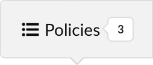

The area under the **Policies** subtab (shown above) in the policy editor contains a table that lists all of the policies defined within a selected policy bundle. The numeric indicator 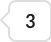 represents the overall number of polices currently defined in the bundle.

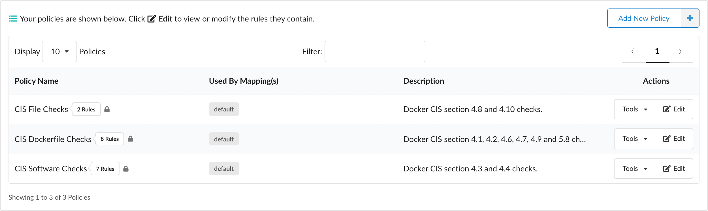

Adjacent to each name in the policy list is a counter that indicates the number of rules within that policy.

**Note:** A lock icon  next to the rule counter indicates that the policy cannot be deleted. Policy rules that are used by policy mappings in the bundle (which will be listed under the **Used By Mapping(s)** column entry) cannot be deleted until they are removed from every associated mapping.

#### Tools

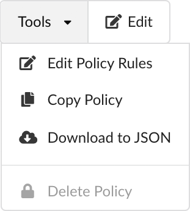

The **Tools** dropdown menu (shown above) in the **Actions** column provides options to:

- Edit the policy
- Copy the policy
- Download the policy as a JSON document
- Delete the policy (provided it is not being used by any policy mapping)

### Adding a New Policy

The **Add New Policy** button (shown above) is used to add a new, empty policy. When clicked you are presented with a dialog where a unique name must be entered along with an optional (but recommended) description for your new policy:

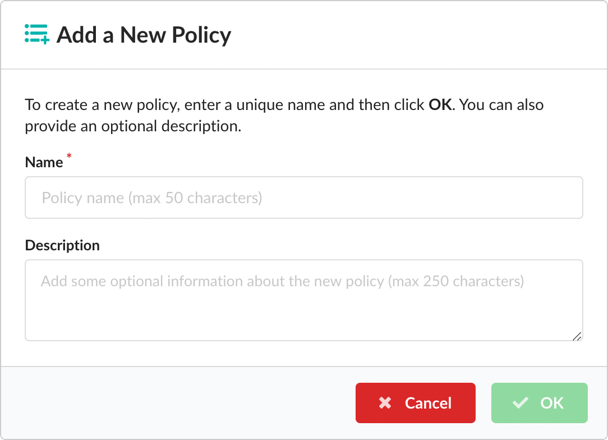

Once you have saved the new policy by clicking the **OK** button, you are immediately taken to the policy rule editor, where you can start adding rules to your new policy.

**Note:** Existing policies may be modified by pressing the  button or selecting **Edit Policy** from the associated **Tools** drop down menu.

### Editing Policies

From the **Edit Policy Rules** dialog you can change the policy name and description by pressing the corresponding  buttons next to the **Name** and **Description** entries in the dialog header. You can also change any documentation associated with individual policy rules by editing the descriptions presented within each row of the table.

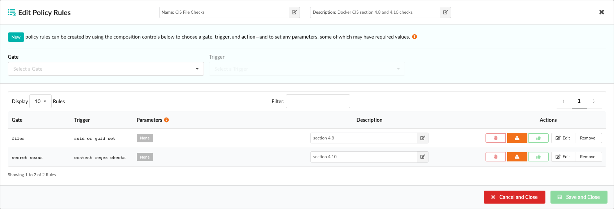

To add a new policy rule, you must first select an item from the **Gate** dropdown list, where each item represents a category of policy checks:

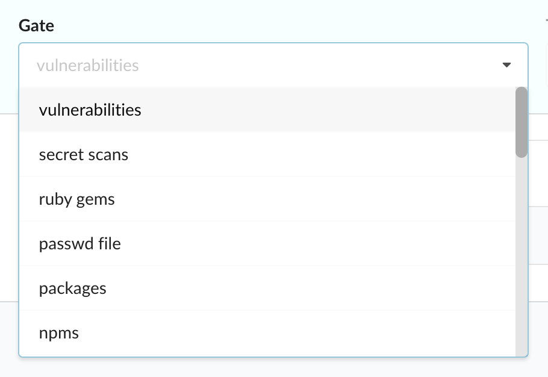

**Note:** After selecting a gate item, an information indicator  will appear next to the dropdown label. Hovering over the indicator will provide some additional descriptive detail about the gate you have selected.

Once a gate has been selected, the **Triggers** drop down will be populated with all the specific checks associated with this item:

Triggers may have *parameters*, some of which may be optional. If any optional parameters are associated with the trigger you select, these will also be displayed in an additional field where they can be added or removed. Optional parameters are described in more detail in the next section.

In the example below the `stale feed data` trigger has a single mandatory parameter: `max days since sync`:

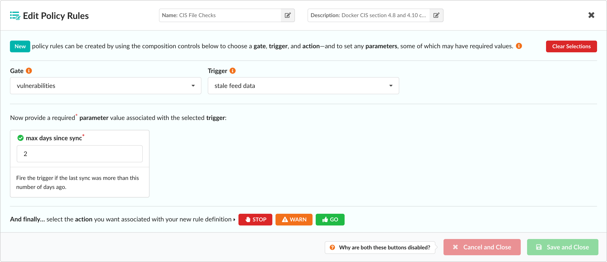

Once a value (in this example the number of days) has been entered into the parameter field, you can then select the _action_ to perform if this condition is met:

The **Action** buttons are only displayed once _all_ required parameters have been provided, or if no mandatory parameters are required. Once an action has been selected, the rule is added to the main list of rules contained in the policy.

The following example described a more sophisticated policy check. The `metadata` gate has a single trigger that allows checks to be performed against various attributes of an image, including image size, architecture, and operating system distribution:

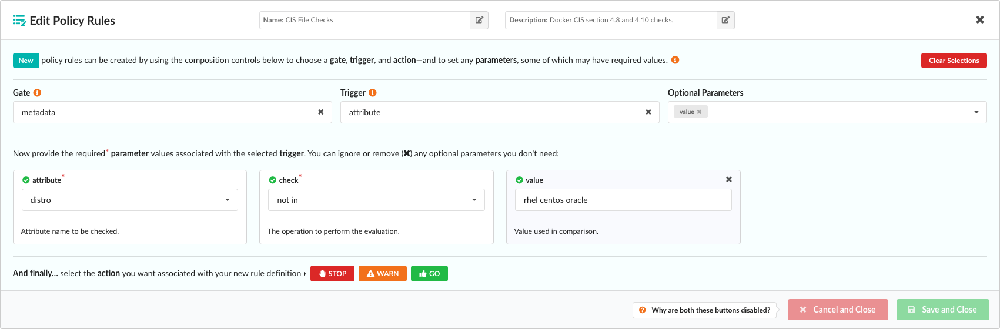

The **Attribute** parameter dropdown includes a number of attributes taken from image metadata, including the operating system distribution, number of layers, and architecture of the image (AMD64, ARM, and so forth):

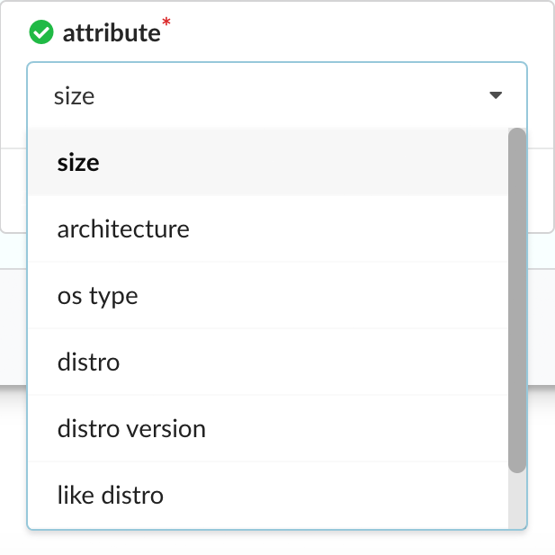

Once an attribute has been selected, the **Check** dropdown is used to create a comparison expression:

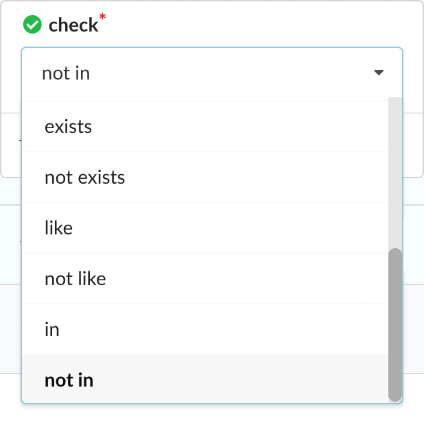

The type of comparison varies based on the attribute. For example the numeric comparison operators such as `>`, `<`, `>=` would be relevant for numeric field such as `size`, while other operators such as `not in` may be useful for querying data field such as `distro`.

In this example, by entering `rhel centos oracle` in the **Value** field, our rule will check that the distro (that is, the operating system) under analysis is _not_ RHEL, Centos, or Oracle:

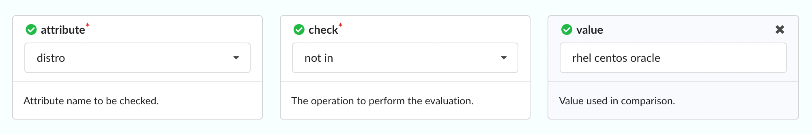

### Optional Parameters

If a trigger has _optional_ parameters, they will be automatically displayed in the policy editor and an editable field next to the **Triggers** dropdown will show all the current selections:

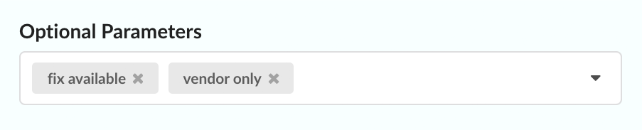

In the example above, a trigger has two optional parameters, both of which are currently displayed.

Unneeded optional parameters can be removed either by clicking the **X** button associated with each entry in the **Optional Parameters** list, or by clicking the **X** button within each associated parameter block:

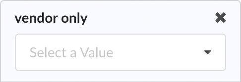

If an optional parameter is removed, it can be reapplied to the rule by clicking the **Optional Parameters** field and selecting it from the resulting dropdown list:

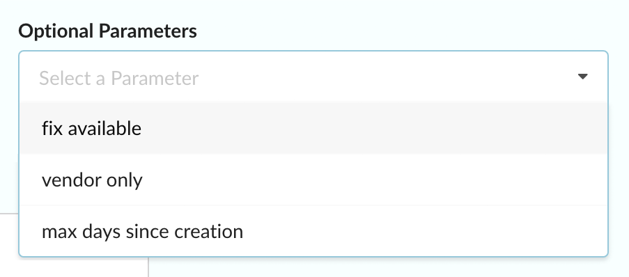

### Editing Rules

After a rule has been added to the policy, it will be displayed in the the edit policy list page as a new entry. The final action of each rule can be modified by clicking the **STOP**, **WARN**, or **GO** buttons.

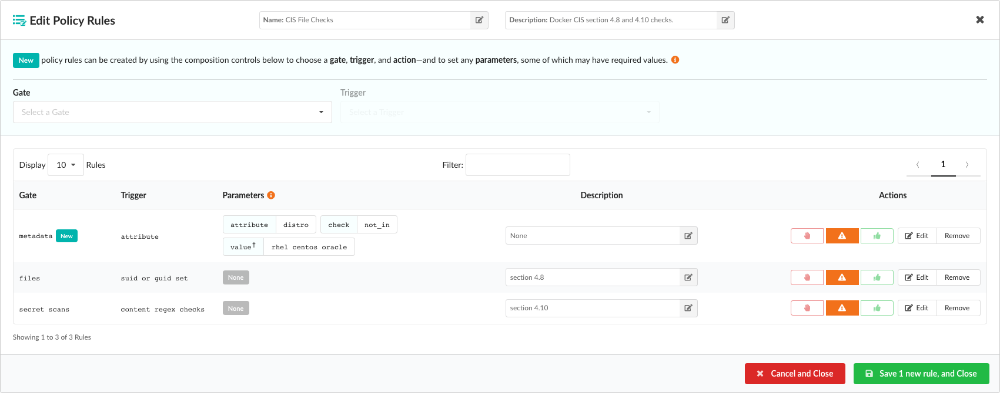

Unwanted rules may be discarded using the **Remove** button, and rules may be edited by selecting the **Edit** button.

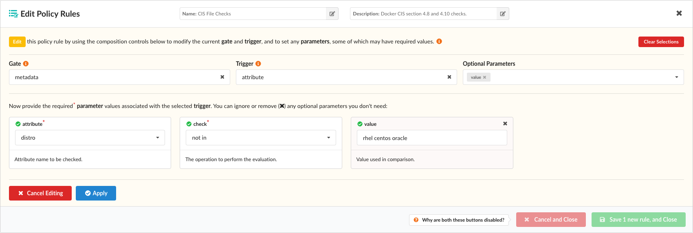

After modifying the existing rule, click **Apply** and the rule will be updated. When you are satisfied that all your new (or updated) rules are correct, you can click the **Save** button to update and store your policy bundle.
