## What is a policy?

A policy is made up from a set of rules that are used to perform an evaluate a container image. These rules can include checks on security vulnerabilities, package whitelists, blacklists, configuration file contents, presence of credentials in image, manifest changes, exposed ports or any user defined checks. These policies can be deployed site wide or customized for specific images or categories of applications. For more conceptual information, refer to the [Policies]() section of the concepts section.

A policy can return one of two results:

**PASSED** indicating that image complies with your policy

**FAILED** indicating that the image is out of compliance with your policy.

### Rules

A policy is comprised of one or more rules.

Each rule is configured with a check to perform, for example ‘check if blacklisted package openssh-server present’. The author or the policy defines the action to take based on that result.

| Action        | Meaning           |
| ------------- | ------------- |
|  | Critical error that should stop the deployment by failing the policy evaluation. |
|  | OK to proceed |
|  | Issue a warning |

Policy rules are made up of Gates and Triggers.
A Gate is a set of policy checks such as vulnerabilities, secret scans, licenses. 
Gates may include one or more individual checks known as triggers.

### Listing Policies

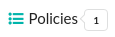

The Policies tab shows a list of the policies defined within the selected Policy Bundle. The indicator 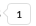 show the number of policies defined. 

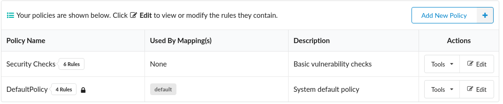

Within the Policy Name field a counter 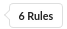 indicates the number of rules within the policy.

The icon indicates that the policy cannot be deleted. Policies that are included in mappings (indicated in the next field) cannot be deleted until they are removed from policy mappings.

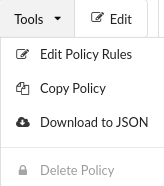

The Tools drop down menu provides options to:

- Edit the policy
- Copy the policy
- Download the policy as a JSON document

### Adding a New Policy

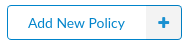 The Add New Policy button is used to add a new, empty policy.

A unique name must be entered along with an optional, but recommended, description.

### Editing Policies

Policies may be modified by pressing the 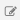 button or selecting Edit the Policy from the Tools drop down menu.

The Edit Policy Rules dialog will be displayed.

The Policy Name and Description can be updated by pressing the corresponding  button.

To add a policy rule you must first select a Gate from the dropdown list.

Each Gate represents a set of policy checks.

After selecting a gate an information indicator  will appear next to the Gate drop down. Hovering over the indicator will show help text.

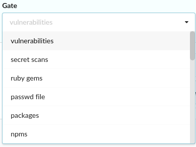

Once a Gate has been selected the Triggers drop down will be populated with relevant checks

Triggers may have parameters some of which may be optional.

In the example below the stale feed data trigger has a single mandatory parameter: max days since sync.
After the number of days has been entered into the parameter field then you need to select the action to perform is this condition is met: 

Once the mandatory parameters and action has been specified the rule can be saved.

**Note:** The save button will not be enabled until all mandatory parameters have been entered.

The following example includes a more sophisticated policy check

The metadata gate has a single trigger that allows checks to be performed against select attributes of an image including image size, architecture and operating system distribution.

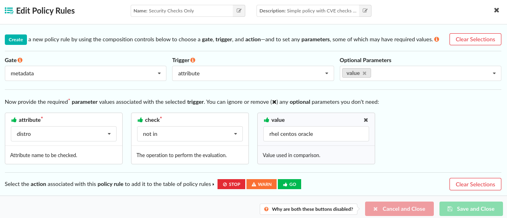

The attribute field shown is a drop down that includes a number of attributes taken from image metadata. 

Including the operating system distribution, number of layers in the image and architecture of the image (AMD64, ARM, etc)

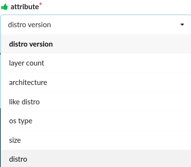

Once an attribute has been selected the **_check_** drop down is used to select the type of comparison.

The type of comparison varies based on the attribute. For example the numeric comparison operators such as >, <, >= would be relevant for numeric field such as size.

While other operators such as not in may be useful for querying data field such as distro

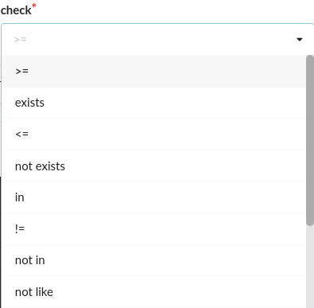

In this example we are checking if the (operating system) distro is not rhel, centos or Oracle.

### Optional Parameters

If a Trigger has optional parameters then the parameter entry fields will be automatically added to the policy editor and a dialog will show the selected optional parameters.

In the example below a trigger has two optional parameters, both of which are currently displayed.

Unneeded optional parameters can be removed in one of two ways:

By pressing the x button on the optional parameters list.

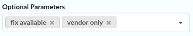

Or by pressing the x button within the parameter block.

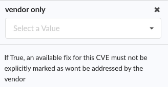

If an optional parameter needs to be re added to the rule then clicking the button on the Optional Parameters down button will allow selection of any optional parameters to be added.

### Editing Rules

After the first rule has been added to the policy, edit policy list page will display a list of rules defined.

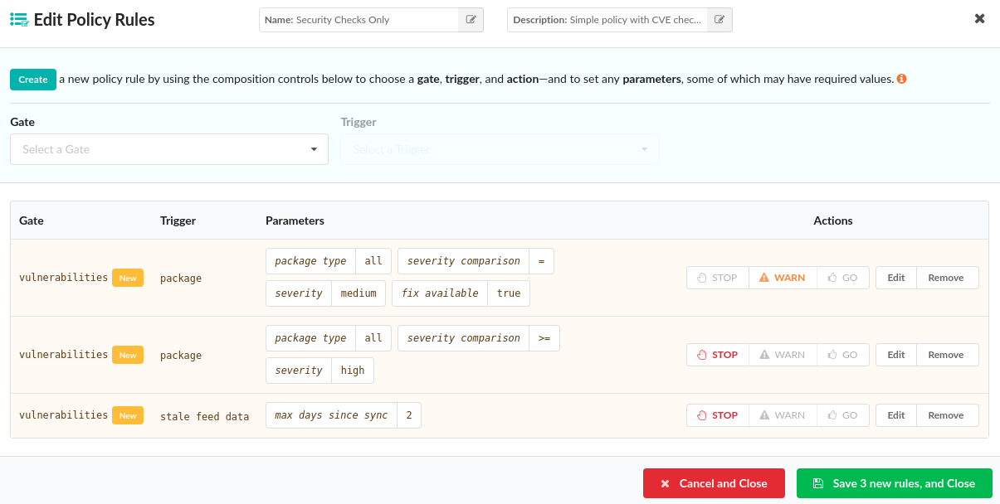

Unwanted rules may be deleted using the 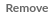 button and rules may be edited by selecting the 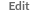 button.

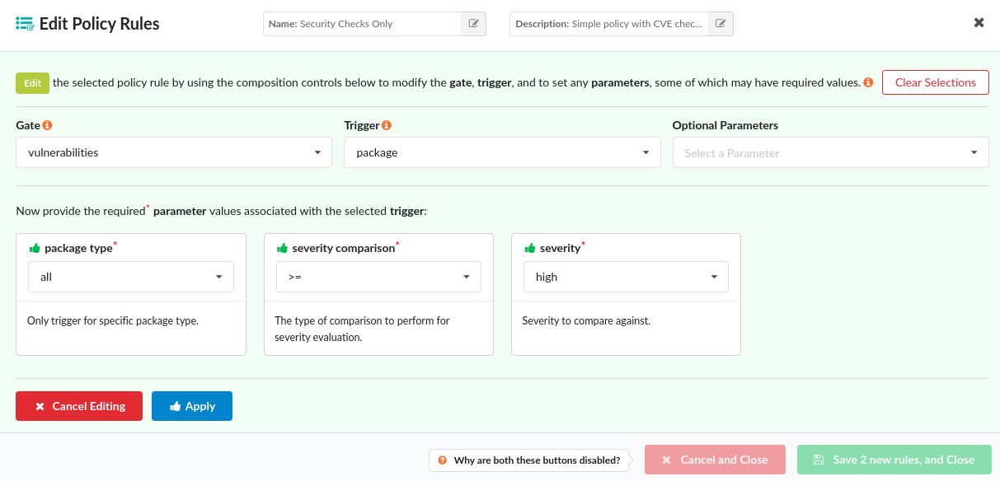

