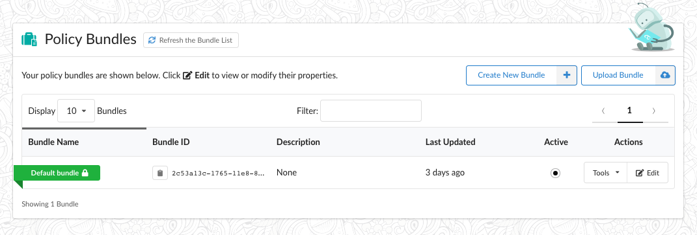
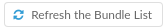
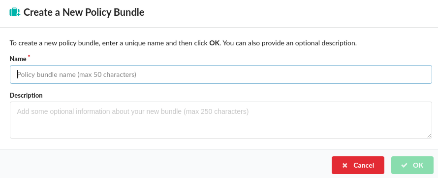
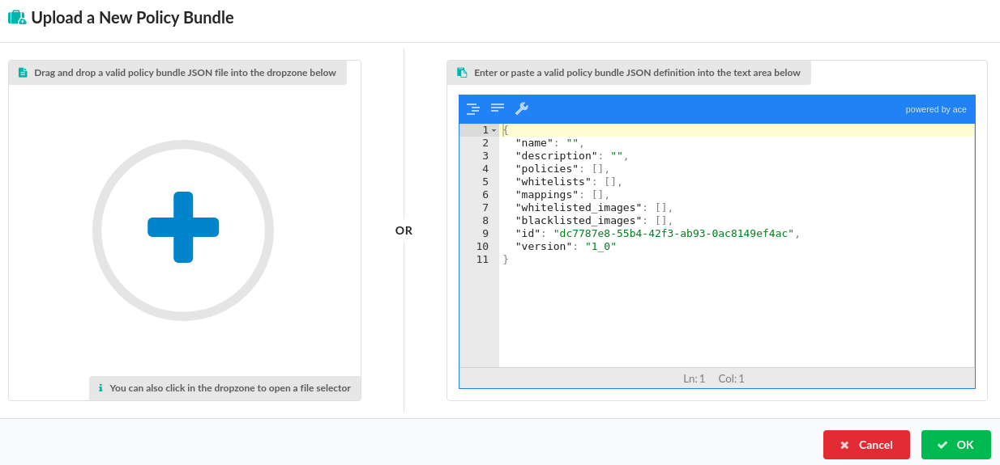
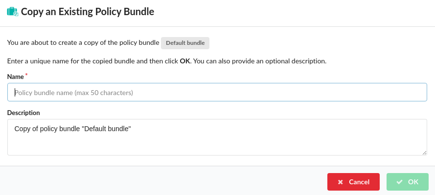
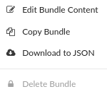
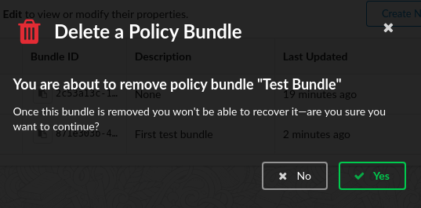

### What is a Policy Bundle

A bundle container 5 elements:

- **Policies**
  A policy is made up from a set of rules that are used to perform an evaluation on a container image. These rules can include checks on security vulnerabilities, package whitelists, blacklists, configuration file contents, presence of credentials in image, manifest changes, exposed ports or any user defined checks. These policies can be deployed site wide or customized for specific images or categories of applications.
  A policy bundle may contain one or more named policies.

- **Whitelists**
  A whitelist contains one or more exceptions that can be used during policy evaluation. For example allowing a CVE to be excluded from policy evaluation.
  A policy bundle may contain multiple whitelists.

- **Mappings**
  A policy mapping defines which policies and whitelists should be used to perform the policy evaluation of a given image based on its registry, repository name, and tag.
  A policy bundle may contain multiple mappings including wildcard mappings that apply to multiple tags.

- **Trusted Image List**
  A Trusted Image list defines one or more images that will always pass policy evaluation regardless of any policy violations.
  Trusted images can be specified by name, image ID or image Digest.
  A policy bundle contains a single list of Trusted Images

- **Blacklisted Image List**
  The Blacklisted Image list defines one or more images that will always fail policy evaluation.
  Blacklisted images can be specified by name, image ID or image Digest.
  A policy bundle contains a single list of Blacklisted Images

### Policy Bundles

The Policy Manager displays a list of bundles loaded in the Anchore Engine. Each Policy Bundle has a unique name, unique ID (UUID), and optionally a description.

The Anchore Engine supports multiple bundles. The Anchore API, CLI, and CI/CD plugins support specifying a Bundle when requesting an image evaluation. For example, the development team may use a different set of policy checks than the operations team. In this case, the development team would specify their bundle ID as part of their policy evaluation request.

If no bundle ID is specified, then the Anchore Engine will use the active bundle which can be considered as the default bundle. Only one bundle can be set as default/active at any time. This bundle will be highlighted with a green ribbon.

**Note:** Bundles which are not marked as Active can still be explicitly requests as part of policy evaluation. 

If multiple users are accessing the Policy Manager or if policy bundles are being added or removed through the API or CLI then you may update the list of bundles using the refresh button.

The following command can be run to list policy bundles using the Anchore CLI

`anchore cli policy list`

### Adding a Policy Bundle

A new, empty policy bundle can be created by pressing the Create New Policy button.

You will be prompted to name the policy bundle. This name should be unique. 

A description is optional but recommended. Once created a unique ID (UUID) will be automatically created by the Anchore Engine.

### Uploading a Policy Bundle

If you have a JSON document containing an existing policy bundle then this may be uploaded into the Anchore Engine.

Selecting the Upload Bundle button will present a dialog allowing for a policy bundle to be uploaded or manually edited in the native JSON format.

Policy Bundle files can be dragged into the dropzone, indicated by a blue plus sign, or clicking in the dropzone will open a file selector dialog allowing a bundle to be loaded from the local filesystem.

Selecting OK will perform validation on a bundle. Only validated bundles may be stored by the Anchore Engine.

The following command can be run to add policy bundles using the Anchore CLI

`anchore-cli policy add /path/to/my/policy/bundle.json`

### Editing a Policy Bundle

Selecting the Edit Policy button will open the policy bundled viewer which is described in the following page.

### Copying a Policy Bundle

The user will be prompted to enter a unique name. The description can be updated.

### Deleting a Policy Bundle

From the Tools menu the Delete Bundle menu option will bring up a dialog to confirm deletion of an existing policy bundle.

**Note:** The active (default) bundle cannot be deleted. To delete the active bundle first you must mark another bundle as active.

The following command can be run to list delete a bundle using the Anchore CLI. The policy must be referenced by its UUID

`$ anchore-cli policy del 2c53a13c-1765-11e8-82ef-23527761d060`

### Downloading a Policy Bundle

 
From the Tools menu the Download to JSON menu option will bring up a file dialog to chose a location and name to save the downloaded JSON file.

The following command can be run to download a bundle using the Anchore CLI. The policy must be referenced by its UUID

`$ anchore-cli policy get 2c53a13c-1765-11e8-82ef-23527761d060  --detail > bundle.json`
