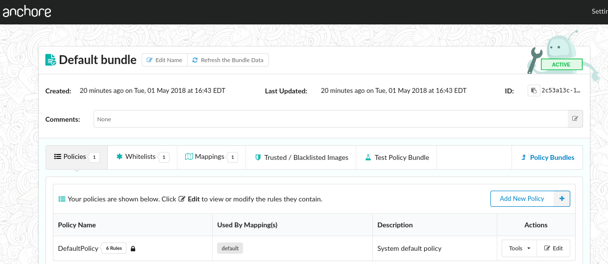
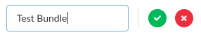
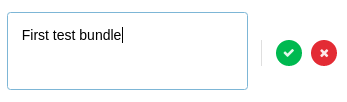
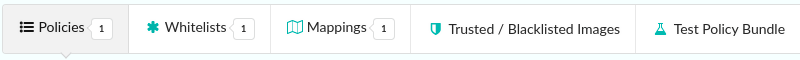

## Introduction

The Policy Bundle page presents an overview of the policy bundle along with tabs to navigate to the components of the policy bundle including the policies, whitelists, mappings, trusted images, blacklisted images and policy test UI.

### Refreshing Policy Bundle

If multiple users are accessing the Policy Manager or if policy items are being added or removed through the API or CLI then you may update the list of bundles using the refresh button.

### Renaming the Policy Bundle

The Bundle name can be updated by selecting the  button.

This will bring up a dialog where the policy bundle name can be updated.

### Policy Bundle Status

As described in the policy manager page, only one policy bundle may be set as active (default).

The Policy Bundle page includes a graphical icon to indicate the status of a bundle.

 This icon indicated that the Policy is Active (default)

 The sleeping robot icon indicated that this policy bundle is not active.

### Policy Bundle Comments

The policy bundle description and comments can be edited by selecting the  button.

This will bring up an edit dialog allowing optional comments to be added.

### Navigating Back to the Bundle List

The browsers navigation buttons or the Policy Bundles button can be used to navigate back to the list of Policy Bundles.

### Editing Bundle Content

Each of the bundle elements can be edited by selecting the appropriate tab in the navigation bar.

