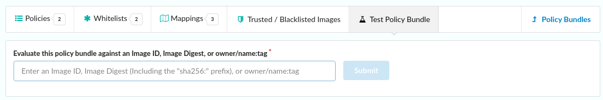
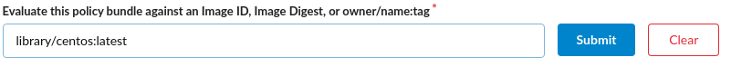
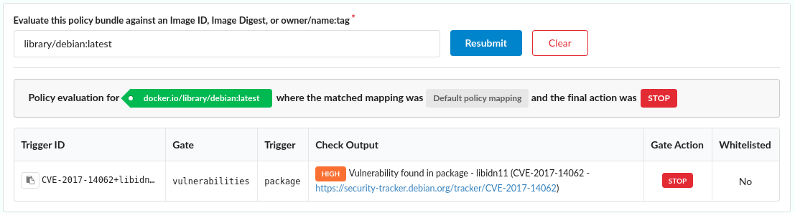
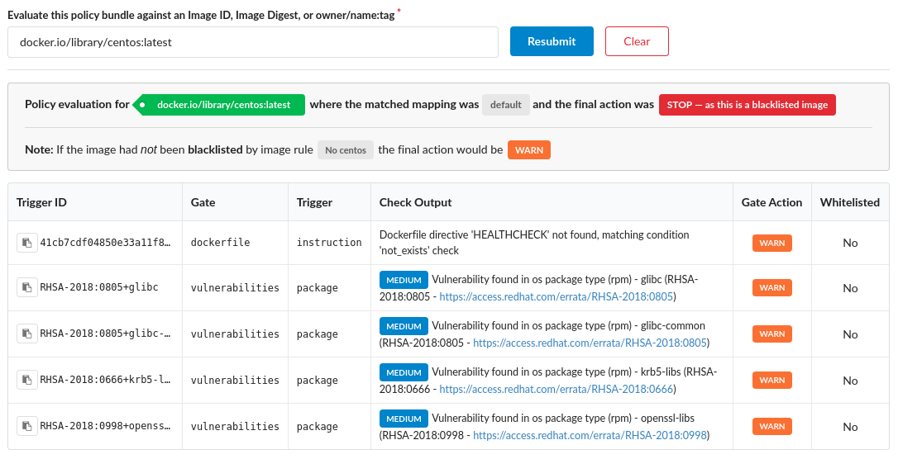
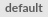
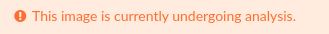
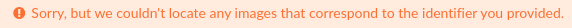

## Introduction

The Test Policy feature allows you to perform a test evaluation on an image to verify the mapping, policies and whitelists used to evaluate an image.

To test an image you should enter the name of the image, optionally including the registry if the image is not stored on docker.io

In the example below an evaluate was requested for library/debian:latest because no registry was specified the default, docker.io registry was used.

Here we can see that the image was evaluated against the mapping named  and  the evaluate failed (the final action was 

In the subsequent table a list of any policy checks that produced a Stop or Warning action will be displayed. In this example above, the image had a single high severity vulnerability that caused the evaluation to be failed.

The following example include a more complex evaluation report.

The image was evaluating using the mapping named  and the evaluation **failed** as the image was found in a blacklist. 

The next line explains that the image had been **blacklisted** by the **No centos** blacklist rule, however if the image was not blacklisted it would only have produced a **warning** instead of a failure. 

The subsequent table lists the policy checks that resulted in any Warning or Stop (failure) checks.

The policy checks are performed on images already analyzed and recorded in the Anchore Engine. If an image has been added to the engine but has not yet completed analysis then the system will display the following error: 

If the evaluation test is re-run after a few minutes the image will likely have completed analysis and a policy evaluation result will be returned.

If the image specified has not been analyzed by the Anchore Engine and has not been submitted for analysis then the following error message will be displayed.

