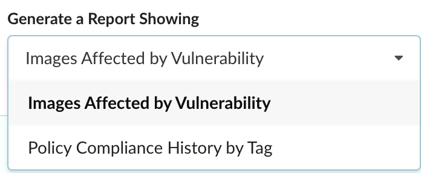
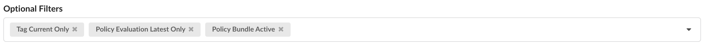
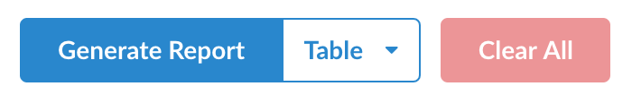

### Overview

Generate a report utilizing the back-end Enterprise Reporting Service through a variety of formats - table, JSON, and CSV. If you’re interested in refining your results, we recommend using the plethora of optional filters provided.

**Note:** Because the reporting data cycle is configurable, the results shown in this view may not precisely reflect actual analysis output at any given time.

For more information on how to modify this cycle or the Reporting Service in general, please refer to the [Reporting Service]() documentation.

The following sections in this document describe how to select a query, add optional filters, and generate a report.

### Reports

#### Selecting a Query

To select a query, click the available dropdown present in the view and select the type of report you’re interested in generating.

##### Images Affected by Vulnerability

View a list of images and their various artifacts that are affected by a vulnerability. By default, a couple optional filters are provided:

|    Filter            |    Description     |
|----------------------|--------------------|
| Vulnerability Id     | Vulnerability ID   |
| Tag Current Only     | If set to true, current tag mappings are evaluated. Otherwise, all historic tag mappings are evaluated |

##### Policy Compliance History by Tag

Query your policy evaluation data using this report type. By default, this report was crafted with compliance history in mind. Quite a few optional filters are provided to include historic tag mappings and historic policy evaluations from any policy bundle that is or was set to **active**. More info below:

|    Filter                     |    Description     |
|-------------------------------|--------------------|
| Registry Name                 | Name of the registry |
| Repository Name               | Name of the repository |
| Tag Name                      | Name of the tag |
| Tag Current Only              | If set to true, current tag mappings are evaluated. Otherwise, all historic tag mappings are evaluated |
| Policy Evaluation Latest Only | If set to true, only the most recent policy evaluation is processed. Otherwise, all historic policy evaluations are evaluated |
| Policy Bundle Active          | If set to true, only the active policy bundle at the time of this query is used. Otherwise, all historically active policy bundles are also included. This attribute is ignored if a policy bundle ID or digest is specified in the filter |

Note that the default filters provided are **optional**.

#### Adding Optional Filters

Once a report type has been selected, an **Optional Filters** dropdown becomes available with items specific to that Query. Such as those listed above, any filters considered default to that report type are also shown.

You can remove any filters you don’t need by pressing the <i class="fas fa-times mx-1"></i> in their top right corner but as long as they’re empty/unset, they will be ignored at the time of report generation.

#### Generating a Report

After a report type has been selected, you immediately can **Generate Report** by clicking the button shown in the bottom left of the view.

By default, the Table format is selected but you can click the dropdown and modify the format for your report by selecting either JSON or CSV.

##### Table

A fast and easy way to browse your data, the table report retrieves paginated results and provides optional sorting by clicking on any column header. Each column is also resizable for your convenience. You can choose to fetch more or fetch all items although please note that depending on the size of your data, fetching all items may take a while.

##### Download Options

Download your report in JSON or CSV format. Various metadata such as the report type, any filters used when querying, and the timestamp of the report are included with your results. Please note that depending on the size of your data, the download may take a while.
