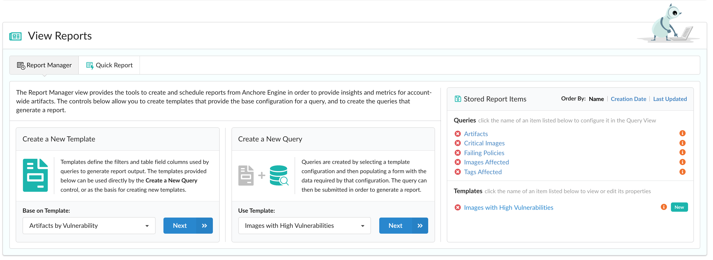
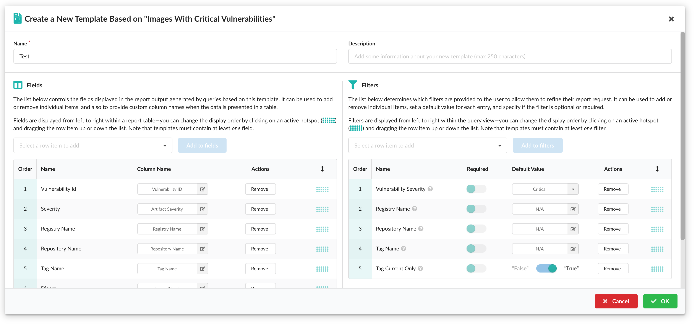
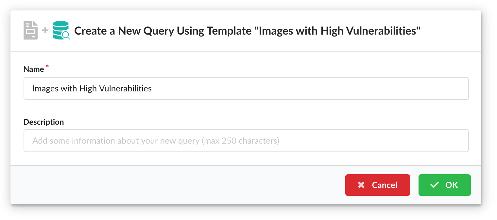
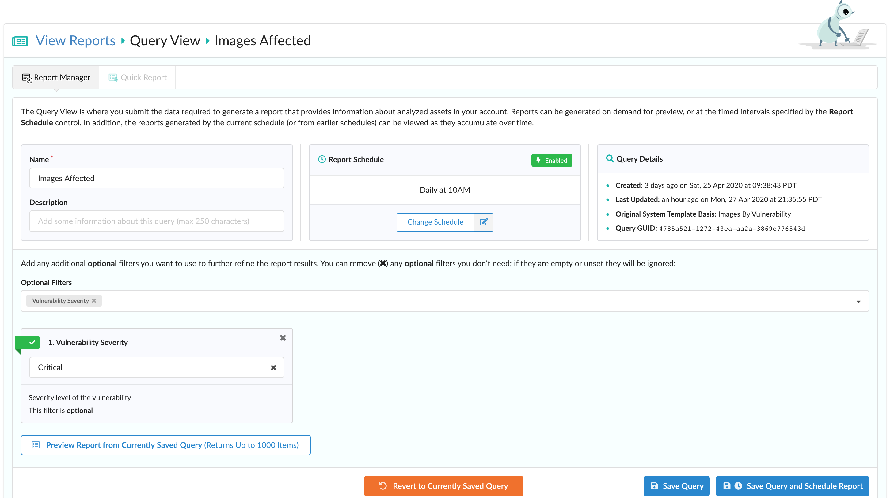
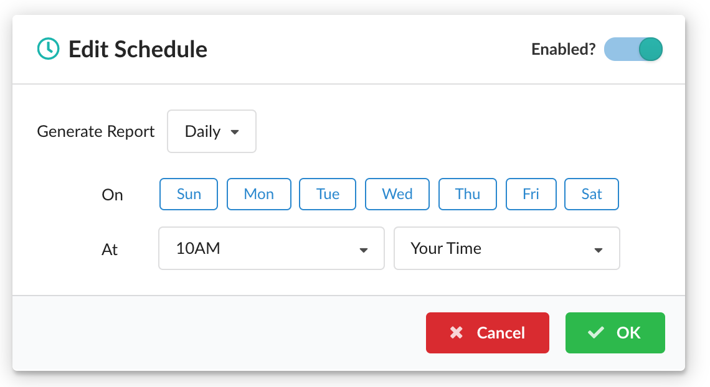
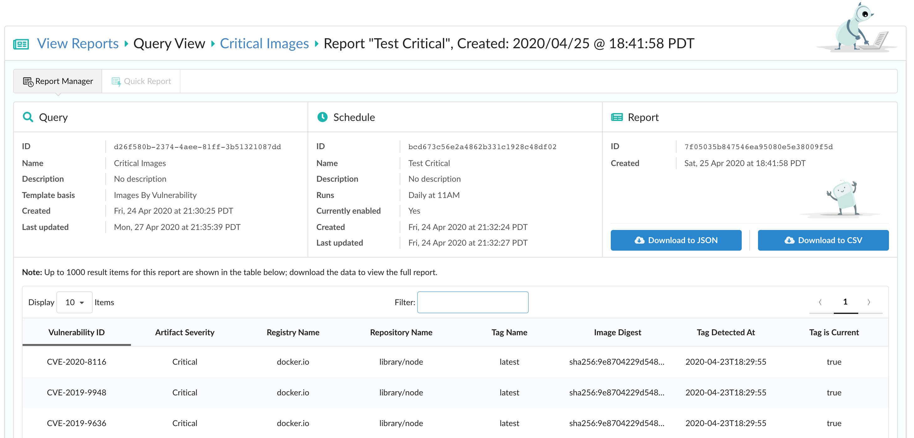
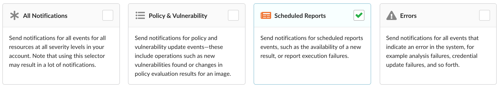

### Overview

Use the Report Manager view to create custom queries, set a report to run on a schedule (or store the configuration for future use), and get notified when they're executed in order to receive the insights you're interested in for account-wide artifacts. The results are provided through a variety of formats - tabular, JSON, or CSV - and rely on data retrieved from the back-end Enterprise Reporting Service.

**Note:** Because the reporting data cycle is configurable, the results shown in this view may not precisely reflect actual analysis output at any given time.

For more information on how to modify this cycle or the Reporting Service in general, please refer to the [Reporting Service]() documentation.

The following sections in this document describe templates, queries, scheduling reports, and viewing your results.

### Report Manager

#### Templates

Templates define the filters and table field columns used by queries to generate report output. The templates provided by the sytem or stored by other users in your account can be used directly to create a new query or as the basis for crafting new templates.

##### System Templates

By default, the UI provides a set of system templates:

Images Failing Policy Evaluation
: This template contains a customized set of filters and fields, and is based on "Policy Compliance History by Tag".

Images With Critical Vulnerabilities
: This template contains a customized set of filters and fields, and is based on "Images Affected by Vulnerability".

Artifacts by Vulnerability
: This templates contains all filters and fields by default.

Tags by Vulnerability
: This templates contains all filters and fields by default.

Images Affected by Vulnerability
: This templates contains all filters and fields by default.

Policy Compliance History by Tag
: This templates contains all filters and fields by default.

##### Creating a Template

In order to define a template's list of fields and filters, navigate to the **Create a New Template** section of the page, select a base configuration provided by the various System Templates listed above, and click **Next** to open a modal.

Provide a name for your new template, add an optional description, and modify any fields or filters to your liking.

The fields you choose control what data is shown in your results and are displayed from left to right within a report table. To optionally refine the result set returned, you can add or remove filter options, set a default value for each entry and specify if the filter is optional or required.

Note that templates must contain at least *one* field and *one* filter.

Once the template is configured to your satisfaction, click **OK** to save it as a **Stored Template**. Your new template is now available to hydrate a query or as a basis for future templates.

##### Editing a Template

To view or edit a template that has been stored previously, click its name under **Stored Report Items** on the right of the page. As with the creation of a template, the list of fields and filters can be customized to your preference.

When you're done, click **OK** to save any new changes or **Cancel** to discard them.

##### Deleting a Template

To delete a template that you have configured previously, click the red "x" to the left of its name under **Stored Report Items** and click **Yes** to remove it. Note that once the template has been removed, you won't be able to recover it.

#### Queries

Queries are based on a template's configuration and can then be submitted to the back-end Enterprise Reporting Service on a reoccurring schedule to generate reports. These results can then be previewed in tabular form and downloaded in JSON or CSV format.

##### Creating a Query

To create a query, navigate to the **Create a New Query** section of the page, select a template configuration, and click **Next** to open a modal.

After you provide a unique name for the query and an optional description, click **OK** to save your new query. You will be automatically navigated to view it.

##### Editing a Query

To view or edit a query, click its name under **Stored Report Items** on the right of the page to be navigated to the Query View.

Within this view, you can edit its name and description, set a schedule to act as the base configuration for Scheduled Items, and view the various filters set by the template this query was based on.

To save any changes to the query, click **Save Query** or **Save Query and Schedule Report**.

###### Setting a Schedule

In order to set or modify a query's schedule, click **Add/Change Schedule** to open a modal.

Reports can be generated daily, weekly, or monthly at a time of your choosing. This can be set according to your timezone or UTC. By default, the schedule is set for weekly on Mondays at 12PM your time.

When scheduling reports to be generated monthly, note that multiple days of the month can be selected and that certain days (the 31st, for example) may not trigger every month.

In the top-right corner of the modal, you can toggle the enabled state of the schedule which determines whether reports will be executed continuously on the timed interval you saved. Note that pressing **OK** modifies the schedule but does not save it to the query. Please click the **Save Query** or **Save Query and Schedule Report** to do so.

##### Deleting a Query

To delete a query, click the red "x" to the left of its name under **Stored Report Items** and click **Yes** to remove it. Note that every scheduled report associated with that query will also be removed and not be recoverable.

#### Scheduled Reports

##### Adding a Scheduled Item

Once you've crafted a query based on a system or custom template, supplied any filters to refine the results, and previewed the report generated to ensure it is to your satisfaction, you can add it to be scheduled by clicking **Save Query and Schedule Report**.

Any schedules created from this view will be listed at the bottom.

##### Editing a Scheduled Item

To edit a scheduled item, click on **Tools** within that entry's **Actions** column and select **Edit Scheduled Item** to open a modal.

Here, you can modify the name, description, and schedule for that item. Click **Yes** to save any new changes or **Cancel** to discard them.

##### Deleting a Scheduled Item

To delete a scheduled item, click on **Tools** within that entry's **Actions** column and select **Delete Scheduled Item**. Note that every report generated from that schedule will also be removed upon clicking **Yes** and will not be recoverable.

#### Viewing Results

Click **View** under a scheduled item's **Actions** column to expand the row and view its list of associated reports sorted by most recent. Click **View** or **Tools > View Results** to navigate to that report's results.

If you configured notifications to be sent when a report has been executed, you can navigate to the report's results by clicking the link provided in its notification.

##### Downloading results

A preview of up to 1000 result items are shown in tabular form which provides optional sorting by clicking on any column header. If a report contains more than 1000 results, please download the data to view the full report. To do so, click **Download to JSON** or **Download to CSV** based on your preferred format.

Various metadata such as the report type, any filters used when querying, and the timestamp of the report are included with your results. Please note that depending on the size of your data, the download may take a while.

##### Configure Notifications

To be notified whenever a report has been generated, navigate to **Events & Notifications > Manage Notifications**. Once any previous notification configurations have loaded, add a new one from your preferred endpoint (Email, Slack, etc), and select the predefined event selector option for **Scheduled Reports**.

This includes the availability of a new result or any report execution failures.

Once you receive a notification, click on the link provided to automatically navigate to the UI to view the results for that report.