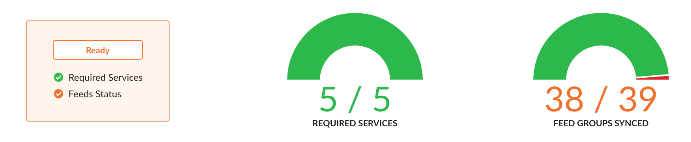
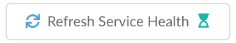
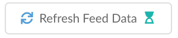
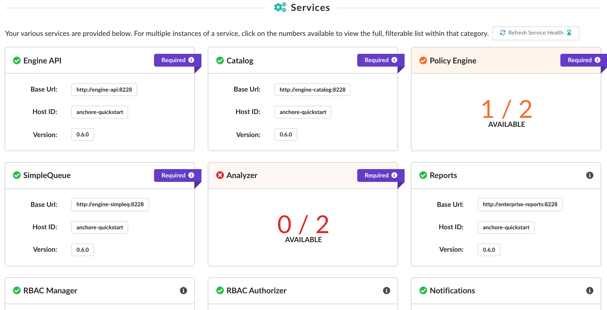
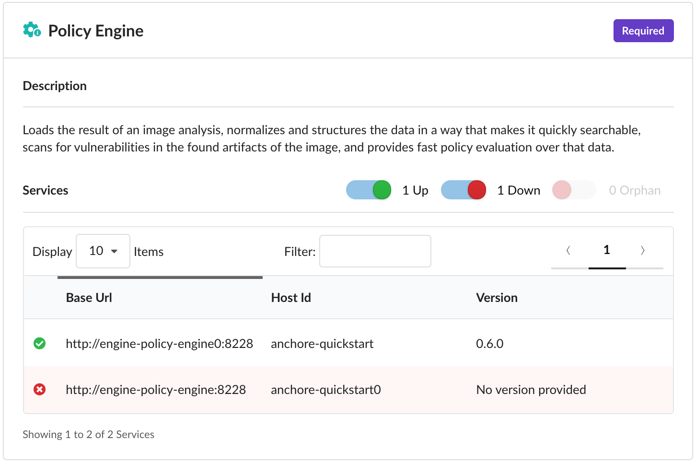
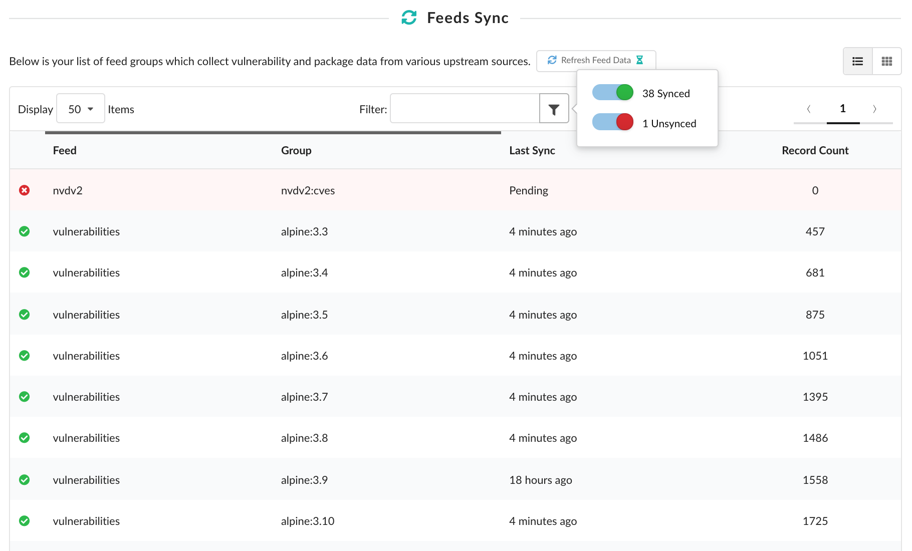
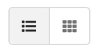
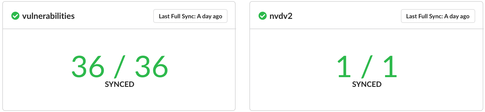
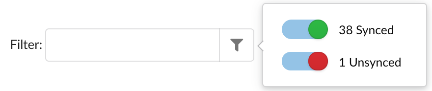

### Overview

Added in Anchore Enterprise 2.2, the **Health** section within the **System** tab is an administrator's new display for investigating the operational status of their system's various services and feeds. Leverage this view to understand when your system is ready or if it requires intervention.

The following sections in this document describe how to determine system readiness, the state of your services, and the progression of your feed sync.

For more information on the overall architecture of a full Anchore Enterprise deployment, please refer to the [Architecture]() documentation. Or refer to the [Feeds Overview]() if you're interested in the feeds-side of things.

### System Readiness

<i class="fas fa-check-circle mr-2" style="color:#21ba45"></i><strong>Ready</strong>

  

    <i class="fas fa-angle-right mr-2"></i>
    All required services have at least one available instance
  

  

    <i class="fas fa-angle-right mr-2"></i>
    Fetch for feeds provides some data (was correctly configured at one point)
  

  

    <i class="fas fa-angle-right mr-2"></i>
    Every feed group successfully returns records (was synced at one point and provides meaningful data)
  

  

    Your system is ready and all feed data is available to you. Craft your custom policy bundle, analyze images, and view in-depth information.
  

<i class="fas fa-check-circle mr-2" style="color:#f2711c"></i><strong>(Tentatively) Ready</strong>

  

    <i class="fas fa-angle-right mr-2"></i>
    All required services have at least one available instance
  

  

    <i class="fas fa-angle-right mr-2"></i>
    Fetch for feeds provides some data (was correctly configured at one point)
  

  

    <i class="fas fa-angle-right mr-2"></i>
    At least one feed group has either not synced or is without records
  

  

    Your required services are available but at least one feed group has either not synced or provided records. Craft your custom policy bundle and interact with the system as you wish but keep in mind that image analyses won't contain complete vulnerability data until all groups have synced.
    

      To clarify, you can still analyze images but you may experience a spike in vulnerabilities once the feeds have completely synced which can cause policy evaluation and analysis result changes.
    

  

<i class="fas fa-times-circle mr-2" style="color:#db2828"></i><strong>Not Ready</strong>

  

    <i class="fas fa-angle-right mr-2"></i>
    At least one of the services required by the system to function is not available
  

  

    <i class="fas fa-angle-right mr-2"></i>
    Fetch for feeds has yet to return anything in the event of a system initialization or feeds misconfiguration
  

  

    Unfortunately, something went wrong. If any of your required services are not available, the main system flow has been impacted and you may be blocked from some actions such as policy evaluation or image analysis.
  

The indicator for system readiness can be seen from any screen by viewing the **System** tab header:

The system readiness status relies on the service and feed data which are routinely updated every 5 minutes. Using the example indicator provided above, once all the feed groups are successfully synced, the status icon will turn green.

For up-to-date information outside of the normal update cycle, navigate to the **Health** section within the **System** tab and click on *Refresh Service Health*, *Refresh Feed Data*, or manually refresh the page.

  
  

### Services

As shown above and as of 2.2, there are five services required by the system to function (Engine API, Catalog, Policy Engine, SimpleQueue, and Analyzer).

For every service, the Base URL, Host ID, and Version is displayed. As long as one instance of each service is up and available, the main system is regarded as ready. In the example image provided above, we see that we have multiple instances of the *Policy Engine* and *Analyzer* services.

For the full, filterable list of instances for that service, click on the numbers provided. In the case of the *Policy Engine*, that would be the `1/2 Available`.

Note that orphaned services are filtered out by default in this view (with a toggle to include it again) but will still impact the availability count on the main page.

In the case of service errors, they are logged within the **Events & Notifications** tab so we recommend following up there for more information or browse our [Troubleshooting]() documentation for remediation guidance.

### Feeds Sync

Listed in this section are the various feed groups your system relies on for vulnerability and package data. This data comes from a variety of upstream sources which is vital for policy engine operations such as evaluating policies or listing vulnerabilities.

As shown, you can keep track of your sync progression using the Last Sync column. To manually update the feed data displayed outside of its normal 5-minute cycle, click the *Refresh Feed Data* button or refresh the page.

If you'd rather have them grouped by feed rather than listed out individually, you can toggle the layout from list to cards using the buttons in the top-right corner above the table:

Similar to the service cards, if you decide to have them grouped as we show below using the layout buttons, you can click on the number of groups synced to view the full, filterable list within.

When viewing a list of feed groups - whether through the default list or through a specific feed card - you can filter for a specific value using the input provided or click on the button attached to filter by category. In this case, groups can be filtered by whether they are `synced` or `unsynced`.

In the case of feed sync errors, they are logged within the **Events & Notifications** tab so we recommend following up there for more information or browse our [Troubleshooting]() documentation for remediation guidance.

Or if you're interested in an overview of the various drivers Enterprise Feeds uses, check out our [Feeds Overview]().